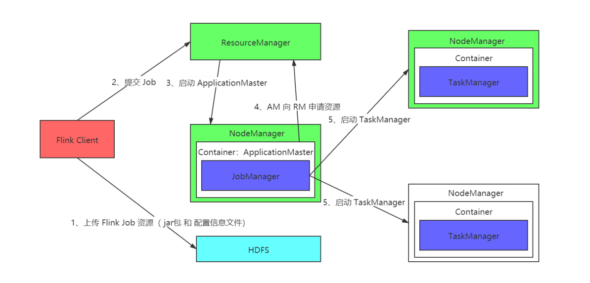
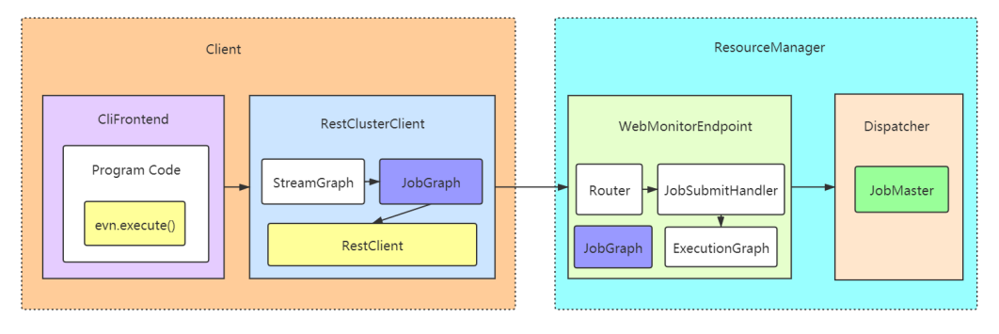
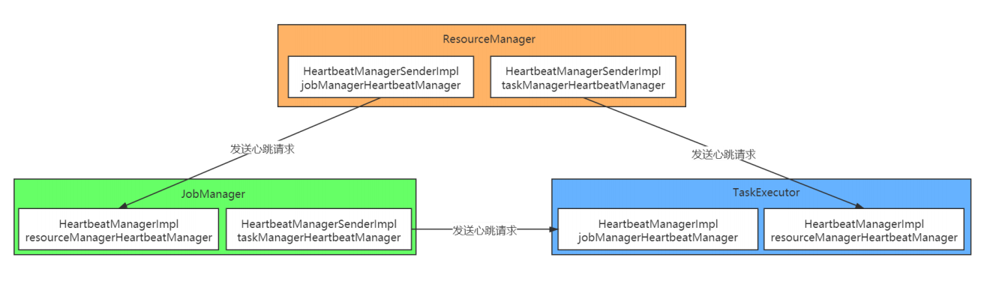
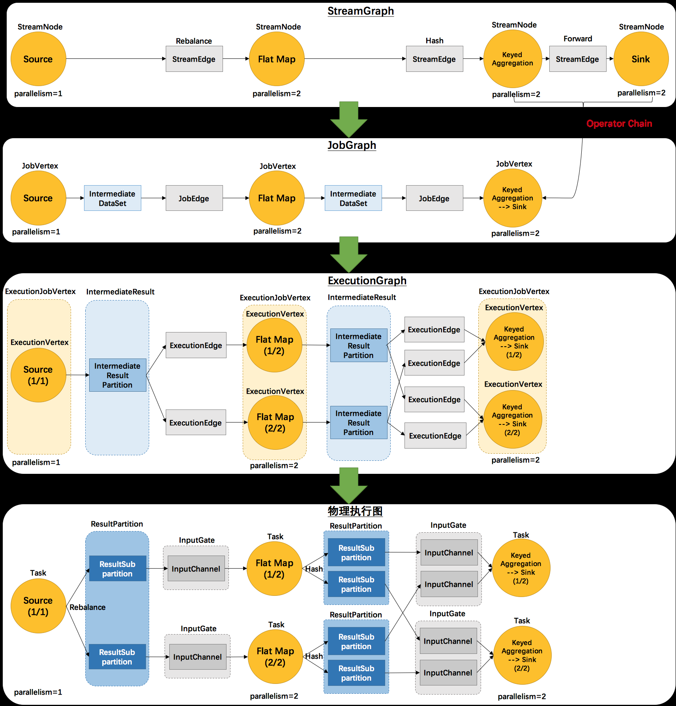
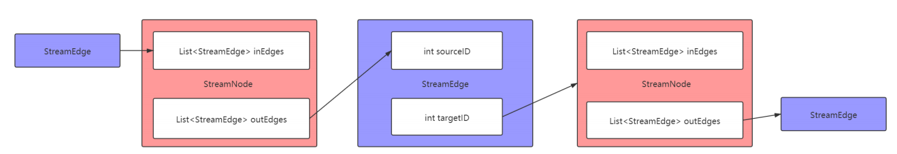
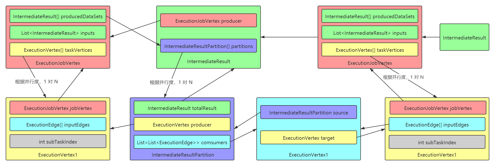

# Flink Job 提交和 Flink Graph 详解

## 1. Flink Program 编程套路总结

Flink应用程序：高级抽象：针对一个任意类型数据的任意类型计算逻辑的任务复杂和数据规模的计算应用程序编写套路的抽象！

Flink 底层提供了一个功能完善且复杂的分布式流式计算引擎，但是上层的应用 API 却很简单，简单来说，把整个 Flink 应用程序的编写，抽象成三个方面：

+ 执行环境 ExectionEnvironment

+ 数据抽象 DataSet DataStream

+ 逻辑操作 Source Transformation Sink

所以 Flink 的应用程序在编写的时候，基本是一个简单的统一套路：

```
1、获取执行环境对象 
StreamExecutionEnvironment env = StreamExecutionEnvironment.getExecutionEnvironment(); 

2、通过执行环境对象，注册数据源Source，得到数据抽象 
DataStream ds = env.socketTextStream(...) 

3、调用数据抽象的各种Transformation执行逻辑计算 
DataStream resultDS = ds.flatMap(...).keyBy(...).sum(...); 

4、将各种Transformation执行完毕之后得到的计算结果数据抽象注册 Sink 
resultDS.addSink(...) 

5、提交Job执行 
env.execute(...) 
```

基本路数，和 Spark 一致，并且，在 Flink-1.12 版本中， DataStream 已经具备高效批处理操作处理了。更加做到了流批处理的统一（API统一）。据"Flink Forward Asia 2020 在线峰会" 阿里流式计算负责人王峰介绍：在 Flink-1.13 版本，将会完全统一流批处理的 API。 

在 Flink 应用程序中，其实所有的操作，都是 StreamOperator，分为 SourceOperator， StreamOperator，SinkOperator，然后能被优化的 Operator就会 chain 在一起，形成一个 OperatorChain。

理解这么几个概念：转换（x => y）= 函数 = UserFunction => StreamOperator => Transformation => OperatorChain（并行化之后，得到StreamTask 执行）


## 2. Flink Job 提交脚本解析

当编写好 Flink 的应用程序，正常的提交方式为：打成 jar 包，通过 flink 命令来进行提交。

flink 命令脚本的底层，是通过 java 命令启动：CliFrontend 类来启动 JVM 进程执行任务的构造和提交。

```shell
flink run xxx.jar class arg1 arg2
```

但是请注意，由于 Flink 的运行模式有多种，这里重点介绍 Flink On YARN 的三种模式：

```shell
# Submission to an already running Flink on YARN cluster 
./bin/flink run --target yarn-session 

# Submission spinning up a Flink on YARN cluster in Per-Job Mode 
./bin/flink run --target yarn-per-job 

# Submission spinning up Flink on YARN cluster in Application Mode 
./bin/flink run-application --target yarn-application 
```

具体可以参考官网：https://ci.apache.org/projects/flink/flink-docs-stable/deployment/cli.html

https://ci.apache.org/projects/flink/flink-docs-stable/deployment/cli.html#advanced-cli

咱们本次课程，主要针对 Flink 的 Standalone 集群模式进行讲解，大致逻辑无差别！

阅读 Flink shell 脚本的内容可知道，最终会转到：CliFrontend 来执行提交处理。

## 3. CliFrontend 提交分析

当用户把 Flink 应用程序打成 jar 使用 flink run ... 的 shell 命令提交的时候，底层是通过 CliFrontend 来处理。底层的逻辑，就是通过反射来调用用户程

序的 main() 方法执行。

在刚组建内部，主要有以下几件事要做：

```
1、根据 flink 后面的执行命令来确定执行方法(run ==> run(params)) 
2、解析 main 参数，构建 PackagedProgram，然后执行 PackagedProgram 
3、通过反射获取应用程序的 main 方法的实例，通过反射调用执行起来
```

总的来说：就是准备执行 Program 所需要的配置，jar 包，运行主类等的必要的信息，然后提交执行（通过反射，转而执行到用户自定义应用程序的

main 方法）。

假如以例子程序： WordCount 来说：转到执行 WordCount 的 main() 方法！


## 4. ExecutionEnvironment 源码解析

Flink 应用程序的执行，首先就是创建运行环境 StreamExecutionEnvironment，一般在企业环境中，都是通过 getExecutionEnvironment() 来获取ExecutionEnvironment，如果是本地运行的话，则会获取到：LocalStreamEnvironment，如果是提交到 Flink 集群运行，则获取到：StreamExecutionEnvironment。

```java
final StreamExecutionEnvironment env = StreamExecutionEnvironment.getExecutionEnvironment();
```

StreamExecutionEnvironment 是 Flink 应用程序的执行入口，提供了一些重要的操作机制：

```
1、提供了 readTextFile(), socketTextStream(), createInput(), addSource() 等方法去对接数据源 

2、提供了 setParallelism() 设置应用程序的并行度 

3、StreamExecutionEnvironment 管理了 ExecutionConfig 对象，该对象负责 Job 执行的一些行为配置管理。还管理了 Configuration 管理一些其 他的配置 

4、StreamExecutionEnvironment 管理了一个 List<Transformation<?>> transformations 成员变量，该成员变量，主要用于保存 Job 的各种算子 转化得到的 Transformation，把这些 Transformation 按照逻辑拼接起来，就能得到 StreamGragh, 注意转换顺序：UserFunction ==> StreamOperator ==> Transformation ==> StreamNode 

5、StreamExecutionEnvironment 提供了 execute() 方法主要用于提交 Job 执行。该方法接收的参数就是：StreamGraph
```

StreamExecutionEnvironment 是 Flink 应用程序执行的上下文，提供了很多功能，不过重点关注以上五点即可。


## 5. Flink on YARN Per-job 模式提交流程分析

ApplicatoinMaster： YarnJobClusterEntryPoint



## 6. Job 提交流程源码分析

核心流程如下：

```java
// 核心入口 
env.execute("Streaming WordCount"); 

// 生成 StreamGraph 
// 执行 StreamGraph 
	execute(getStreamGraph(jobName) 
);
```

**第一步：getStreamGraph(jobName) 生成 StreamGraph 解析**

```java
// 入口 
StreamGraph streamGraph = getStreamGraph(jobName, true); 

    // 通过 StreamGraphGenerator 来生成 StreamGraph 
    StreamGraph streamGraph = getStreamGraphGenerator().setJobName(jobName).generate(); 

        streamGraph = new StreamGraph(....) 
        for(Transformation<?> transformation : transformations) { 
       		transform(transformation); 
        }
```

transform(transformation) 的内部实现：

```java
transform(transformation); 

    // 先递归处理该 Transformation 的输入 
    Collection<Integer> inputIds = transform(transform.getInput()); 

    // 将 Transformation 变成 Operator 设置到 StreamGraph 中，其实就是添加 StreamNode 
    streamGraph.addOperator(....) 

    // 设置该 StreamNode 的并行度 
    streamGraph.setParallelism(transform.getId(), parallelism); 

    // 设置该 StreamNode 的入边 SreamEdge 
    for(Integer inputId : inputIds) { 
        streamGraph.addEdge(inputId, transform.getId(), 0); 

            // 内部实现 
            // 构建 StreamNode 之间的 边（StreamEdge） 对象 
            StreamEdge edge = new StreamEdge(upstreamNode, downstreamNode, ...) 
            // TODO_MA 注释： 给 上游 StreamNode 设置 出边 
            getStreamNode(edge.getSourceId()).addOutEdge(edge); 
            // TODO_MA 注释： 给 下游 StreamNode 设置 入边 
            getStreamNode(edge.getTargetId()).addInEdge(edge); 
	}
```

**第二步：execute(StreamGraph) 解析**

```java
// 入口 
JobClient jobClient = executeAsync(streamGraph); 

	// 执行一个 SreamGraph 
	executorFactory.getExecutor(configuration).execute(streamGraph, configuration); 

		// 第一件事：由 StreamGraph 生成 JobGragh 
		JobGraph jobGraph = PipelineExecutorUtils.getJobGraph(pipeline, configuration); 

		// 第二件事：通过 RestClusterClient 提交 JobGraph 到Flink集群 
		clusterClient.submitJob(jobGraph) 
```

继续提交：

```java
// 通过 RestClusterClient 来提交 JobGraph 
RestClusterClient.submitJob(JobGraph jobGraph); 

    // 继续提交 
    RestClusterClient.sendRetriableRequest() 

        // 通过 RestClient 提交 
        RestClient.sendRequest(webMonitorHost, webMonitorPort, ...) 

            // 继续提交 
            RestClient.submitRequest(targetAddress,targetPort,httpRequest,responseType) 
```

最终通过 channel 把请求数据，发给 WebMonitorEndpoint 中的 JobSubmitHandler 来执行处理。

关于客户端的 Job 的提交，总结为这么几个步骤：

```
01、用户根据 Flink 应用程序的编写套路，写好应用程序，打成 jar 包，通过 flink run 的命令来执行提交 
02、这个命令的底层，其实是执行： CliFrontend 组件来执行提交 
03、这个 CliFrontend 的内部，会通过反射的技术，来转交执行到 用户自定义应用程序的 main() 
04、先获取 StreamExecutionEnvironment 执行环境对象实例 
05、执行算子：其实就是从 算子 --- function --- StreamOperator --- Transformation 
06、执行 StreamExecutionEnvironment 的 executor 方法来执行提交 
07、首先遍历 StreamExecutionEnvironment 的 transformations 这个 list 来生成 StreamGraph 
08、具体的内部的提交是通过 RestClusterClient 来执行提交 
09、在通过 RestClusterClient 提交之前，其实还会做一件事：把 SreamGraph 变成 JobGraph，也还会先把 JobGraph 持久化成为一个磁盘文件 
10、在这个 RestClusterClient 的内部，其实是通过 RestClient 来提交 
11、RestClient 其实在初始化的时候，就初始化了一个 Netty 客户端 
12、通过 封装一个 HttpRequest 对象，通过 Netty 客户端 链接服务端，发送请求对象 
13、Flink 主节点 JobManager 负责处理这个请求的是 WebMonitorEndpoint 中的 Netty 服务端，接收到 rest 请求会调用 Router 执行 route 处
理，找到对应的 Handler 执行处理。提交 Job 对应的 Handler 是 JobSubmitHandler 
```




## 7. WebMonitorEndpoint 处理 RestClient 的 JobSubmit 请求

最终处理这个请求： Flink 主节点 JobManager 负责处理这个请求的是 WebMonitorEndpoint 中的 Netty 服务端，接收到 rest 请求会调用 Router 执行route 处理，找到对应的 Handler 执行处理。提交 Job 对应的 Handler 是 JobSubmitHandler

核心入口：

```java
// JobManager 服务端处理入口 
JobSubmitHandler.handleRequest(); 

    // 恢复得到 JobGraph 
    JobGraph jobGraph = loadJobGraph(requestBody, nameToFile); 

    // 通过 Dispatcher 提交 JobGraph 
    Dispatcher.submitJob(jobGraph, timeout)
```

Dispatcher 的提交执行逻辑：

```java
Dispatcher.persistAndRunJob() 

    // 保存 JobGraph 在 ZK 上 
    jobGraphWriter.putJobGraph(jobGraph); 

    // 提交 JobGraph 执行 
    // Dispatcher 最重要的事情 就是帮忙启动 JobMaster 
    Dispatcher.runJob(jobGraph); 

        // 主要的事情，是创建和启动 JobMaster 
        // 在这句代码的内部，有一件非常重要的事情： 把 JobGraph 变成 ExecutionGraph 
        // 看起来是创建 JobManagerRunner，其实是得到： JobManagerRunnerImpl 
        Dispatcher.createJobManagerRunner(jobGraph); 

            // 初始化 new JobManagerRunnerImpl 
            new JobManagerRunnerImpl() 

            // 第一件事：选举服务, 只是通过选举的方式，来把自己的信息，写入到zk中 
            leaderElectionService.start(this); 
                // 通过 Driver 来选举 
                leaderElectionDriver = leaderElectionDriverFactory.createLeaderElectionDriver(this, ....); 
                    new ZooKeeperLeaderElectionDriver(client, latchPath, leaderPath,....); 
                        // 选举开始之后，如果选举成功，则回调 
                        ZooKeeperLeaderElectionDriver.isLeader(); 
                            leaderElectionEventHandler.onGrantLeadership(); 
                                // 此时这个地方的 leaderContender = JobManagerRunnerImpl 
                                leaderContender.grantLeadership(issuedLeaderSessionID); 
                                    // 校验调度准太，并且开启 JobManager 
                                    verifyJobSchedulingStatusAndStartJobManager(leaderSessionID); 
                                        // 开启 JobMaster 
                                        startJobMaster(leaderSessionId); 
                                            // JobMasterService 启动 
                                            jobMasterService.start(new JobMasterId(leaderSessionId)); 
                                                // 进入 onStart() 方法 
                                                start(); 
                                                    // 然后跳转到 JobMaster 的 onStart() 方法。 
                                                    onStart() 
                                                // 开始执行 
                                                startJobExecution(newJobMasterId) 
                                                    // 启动 JobMaster 相关的服务 
                                                    startJobMasterServices(); 
                                                        // 第一：心跳服务 
                                                        startHeartbeatServices(); 
                                                        // 第二：Slot 管理服务 
                                                        slotPool.start(....); 
                                                        // 第三：联系 ResourceManager 进行注册 
                                                        reconnectToResourceManager(new FlinkException(....)); 
                                                        // 第四：监听 ResourceManager 地址的变化 
                                                        resourceManagerLeaderRetriever.start(new 
                                                        ResourceManagerLeaderListener()); 
                                                    // 开始调度执行 
                                                    resetAndStartScheduler(); 
                                                    	// requestSlot() deployAll(); 
            // 第二件事： 创建 JobMasterService 
            this.jobMasterService = jobMasterFactory.createJobMasterService(jobGraph, .....); 
                // 初始化 JobMaster, 构造方法有一个参数，叫做 jobGraph, 然后在构造方法中，需要完成一个操作： 
                // 把 JObGraph 变成 ExecutionGraph 
                new JobMaster(...) 
                    // 创建 SlotPool 
                    this.slotPool = checkNotNull(slotPoolFactory).createSlotPool(jid); 
                    // 创建 DefaultScheduler 
                    this.schedulerNG = createScheduler(jobManagerJobMetricGroup); 
                        schedulerNGFactory.createInstance(..., jobGraph, ...); 
                            new DefaultScheduler(); 
                                super() 
                                    this.executionGraph=createAndRestoreExecutionGraph(); 
                                        // 重点：创建 ExecutionGraph 
                                        newExecutionGraph = createExecutionGraph(); 
                                            // 通过 ExecutionGraphBuilder 来创建 ExecutionGraph 
                                            ExecutionGraphBuilder.buildGraph(null, jobGraph, .....);
```


主节点启动的时候的三大角色的功能作用：

| 组件               | 作用                                                         |
| ------------------ | ------------------------------------------------------------ |
| WebMonitorEndpoint | 启动了一个 Netty 服务端接收 客户端的 rest 请求，然后根据 请求 url 来调用对应的 handler 来执行处理 |
| ResourceManager    | 只是负责管理集群的资源，维持和从节点之间的心跳               |
| Dispatcher         | WebMonitorEndpoint当中的 JobSubmitHandler 接收到一个请求处理之后恢复得到一个 JobGraph 转交给 Dispatcher |

最后的结论： 启动的这个 JobMaster 负责这个 Job 中的所有的 Task 的 slot 的申请和 任务的派发，状态的跟踪，容错，还有 checkpoint等各种操作！

接上面的继续：startJobMaster() 继续执行：最重要是两件事：

```
1、JobMaster 向 ResourceManager 注册, 注册成功之后，维持心跳！ 
2、JobMaster 向 ResourceManager 申请 Slot，部署 StreamTask 运行！
```

```java
startJobMaster(leaderSessionId); 

runningJobsRegistry.setJobRunning(jobGraph.getJobID()); 

jobMasterService.start(new JobMasterId(leaderSessionId)); 

// 内部主要做两件事： 

// startJobMasterServices(); 

// resetAndStartScheduler(); 

startJobExecution(newJobMasterId), RpcUtils.INF_TIMEOUT); 

// 第一件事：跑起来 JobMaster 相关的服务，主要是注册 和 心跳 

startJobMasterServices(); 

startHeartbeatServices(); 

slotPool.start(getFencingToken(), getAddress(), getMainThreadExecutor()); 

scheduler.start(getMainThreadExecutor()); 

reconnectToResourceManager(new FlinkException("...")); 

closeResourceManagerConnection(cause); 

tryConnectToResourceManager(); 

connectToResourceManager(); 

resourceManagerConnection = new ResourceManagerConnection() 

resourceManagerConnection.start(); 

createNewRegistration(); 

newRegistration.startRegistration(); 

register(...) 

invokeRegistration(...); 

gateway.registerJobManager(...) 

// 完成注册 

registerJobMasterInternal() 

// 监听 ResourceManager 

resourceManagerLeadRetriever.start(new ResourceManagerLeaderListener()); 

// 第二件事：开始申请 Slot，并且部署 Task 

resetAndStartScheduler(); 

JobMaster.startScheduling() 

schedulerNG.startScheduling(); 

// 启动所有的服务协调组 

startAllOperatorCoordinators(); 

// 开始调度 

startSchedulingInternal(); 

// 更改状态 

prepareExecutionGraphForNgScheduling(); 

// 开始调度 

schedulingStrategy.startScheduling(); 

allocateSlotsAndDeploy(...)
```


接着继续：

```java
allocateSlotsAndDeploy(...) 

DefaultScheduler.allocateSlotsAndDeploy(executionVertexDeploymentOptions); 

// 申请 Slot 

allocateSlots(executionVertexDeploymentOptions); 

// 部署 Task 运行 

waitForAllSlotsAndDeploy(deploymentHandles);
```


## 8. 关于 JobMaster 的注册和心跳

Flink 中 ResourceManager、JobMaster、TaskExecutor 三者之间存在相互检测的心跳机制，ResourceManager 会主动发送请求探测 JobMaster、TaskExecutor 是否存活，JobMaster 也会主动发送请求探测 TaskExecutor 是否存活，以便进行任务重启或者失败处理。

假定心跳系统中有两种节点：sender 和 receiver。心跳机制是 sender 和 receivers 彼此相互检测。但是检测动作是 Sender 主动发起，即 Sender 主动发送请求探测 receiver 是否存活，因为 Sender 已经发送过来了探测心跳请求，所以这样 receiver 同时也知道 Sender 是存活的，然后 Reciver 给Sender 回应一个心跳表示自己也是活着的。具体表现：

+ Flink Sender 主动发送 Request 请求给 Receiver，要求 Receiver 回应一个心跳；

+ Flink Receiver 收到 Request 之后，通过 Receive 函数回应一个心跳请求给 Sender；

见图：




## 9. Flink Graph 演变

Flink 的一个 Job，最终，归根结底，还是构建一个高效率的能用于分布式并行执行的 DAG 执行图。

一个 Flink 流式作业，从 Client 提交到 Flink 集群，到最后执行，总共会经历四种不同的状态。总的来说：

```
1、Client 首先根据用户编写的代码生成 StreamGraph，然后把 StreamGraph 构建成 JobGraph 提交给 Flink 集群主节点 

2、然后启动的 JobMaster 在接收到 JobGraph 后，会对其进行并行化生成 ExecutionGraph 后调度启动 StreamTask 执行。 

3、StreamTask 并行化的运行在 Flink 集群中的，就是最终的物理执行图状态结构。
```

Flink 中的执行图可以分成四层：**StreamGraph** ==> **JobGraph** ==> **ExecutionGraph** ==> **物理执行图**。

**StreamGraph**：是根据用户通过 Stream API 编写的代码生成的最初的图。用来表示程序的拓扑结构。

**JobGraph**：StreamGraph 经过优化后生成了 JobGraph，提交给 JobManager 的数据结构。主要的优化为，将多个符合条件的节点 chain 在一起作为一

个节点，这样可以减少数据在节点之间流动所需要的序列化反序列化传输消耗。

**ExecutionGraph**：JobManager 根据 JobGraph 生成 ExecutionGraph。ExecutionGraph 是 JobGraph 的并行化版本，是调度层最核心的数据结构。

**物理执行图**：JobManager 根据 ExecutionGraph 对 Job 进行调度后，在各个 TaskManager 上部署 Task 后形成的图，并不是一个具体的数据结构。

关于这四层之间的演变，请看下图：



上面这张图清晰的给出了 Flink 各个图的工作原理和转换过程。其中最后一个物理执行图并非 Flink 的数据结构，而是程序开始执行后，各个 Task 分布在

不同的节点上，所形成的物理上的关系表示：

从 JobGraph 的图里可以看到，数据从上一个 operator（JobVertex） 流到下一个 operator（JobVertex） 的过程中，上游作为生产者提供了

IntermediateDataSet，而下游作为消费者需要 JobEdge。事实上，JobEdge 是一个通信管道，连接了上游生产的 dataset和下游的 JobVertex 节

点。

在 JobGraph 转换到 ExecutionGraph 的过程中，主要发生了以下转变：

加入了并行度的概念，成为真正可调度的图结构

生成了与 JobVertex 对应的 ExecutionJobVertex，ExecutionVertex，与 IntermediateDataSet 对应的 IntermediateResult 和

IntermediateResultPartition 等，并行将通过这些类实现

ExecutionGraph 已经可以用于调度任务。我们可以看到，Flink 根据该图生成了一一对应的 Task，每个 Task 对应一个ExecutionGraph 的一个

Execution。Task 用 InputGate、InputChannel 和 ResultPartition 对应了上面图中的 IntermediateResult和 ExecutionEdge。

那么，设计中为什么要设计这么四层执行逻辑呢？它的意义是什么？

```
1、StreamGraph 是对用户逻辑的映射 

2、JobGraph 在 StreamGraph 基础上进行了一些优化，比如把一部分操作串成 chain 以提高效率 

3、ExecutionGraph 是为了调度存在的，加入了并行处理的概念 

4、物理执行结构：真正执行的是 Task 及其相关结构
```

总计：FLink 的四层图概念：

```
1、StreamGraph 就是通过用户编写程序时指定的算子进行逻辑拼接的 
简单说：就是进行算子拼接 

2、JobGraph 其实就是在StreamGraph的基础之上做了一定的优化，然后生成的逻辑执行图 
简单说：就是把能 优化拼接在一起，放在一个Task中执行的算子的整合和优化 chain 在一起形成 OperatorChain，这个操作就类似于 Spark Stage 切分 

3、ExecutionGraph 再把JobGraph进行并行化生成ExecutionGraph 简单说：其实ExecutionGraph就是JobGraph的并行化版本 

4、物理执行图 其实是 ExecutionGraph 调度运行之后形成的分布，当一个 Flink Stream Job 中的所有的 Task都被调度执行起来了之后的状态
```


```
1、StreamGraph 转变成 JobGraph： 帮我们把上下游两个相邻算子如果能 chain 到一起，则 chain 到一起做优化 

2、JobGraph 转变成 ExecutionGraph： chain 到一起的多个 Operator 就会组成一个 OperatorChain，当 OperatorChain 执行的时候，到底要执
行多少个 Task，则就需要把 DAG 进行并行化变成实实在在的 Task 来调度执行
```


### 9.1. StreamGraph 构建和提交源码解析

StreamGraph：根据用户通过 Stream API 编写的代码生成的最初的图。Flink 把每一个算子 transform 成一个对流的转换（比如

SingleOutputStreamOperator， 它就是一个 DataStream 的子类），并且注册到执行环境中，用于生成 StreamGraph。

它包含的主要抽象概念有：

```
1、StreamNode：用来代表 operator 的类，并具有所有相关的属性，如并发度、入边和出边等。 
2、StreamEdge：表示连接两个 StreamNode 的边。
```

源码核心代码入口：

```java
StreamExecutionEnvironment.execute(getStreamGraph(jobName));
```

其中：

```
1、getStreamGraph(jobName) 先生成一个 SteamGraphGenerator, 然后调用 generate() 方法生成一个 StreamGraph 
2、StreamExecutionEnvironment.execute() 用于执行一个 StreamGraph
```

StreamGraph 生成过程中，生成 StreamNode 的代码入口：

```java
streamGraph.addOperator(vertexID, slotSharingGroup, coLocationGroup, operatorFactory, inTypeInfo, outTypeInfo, operatorName);
```

StreamGraph 生成过程中，生成 StreamEdge 的代码入口：

```java
streamGraph.addEdge(inputId, transform.getId(), 0);
```




### 9.2. JobGraph 构建和提交源码解析

JobGraph：StreamGraph 经过优化后生成了 JobGraph，提交给 JobManager 的数据结构

它包含的主要抽象概念有：

```
1、JobVertex：经过优化后符合条件的多个StreamNode可能会chain在一起生成一个JobVertex，即一个JobVertex包含一个或多个operator，JobVertex的输入是JobEdge，输出是IntermediateDataSet。

2、IntermediateDataSet：表示JobVertex的输出，即经过operator处理产生的数据集。producer是JobVertex，consumer是JobEdge。

3、JobEdge：代表了jobgraph中的一条数据传输通道。source是IntermediateDataSet，target是JobVertex。即数据通过JobEdge由
IntermediateDataSet传递给目标JobVertex。
```

源码核心代码入口：

```java
final JobGraph jobGraph = PipelineExecutorUtils.getJobGraph(pipeline, configuration);
```

经过层层递进：

```java
StreamingJobGraphGenerator.createJobGraph(this, jobID);
```

在 StreamGraph 构建 JobGragh 的过程中，最重要的事情就是 operator 的 chain 优化，那么到底什么样的情况的下 Operator 能chain 在一起呢？

```
// 1、下游节点的入度为1 （也就是说下游节点没有来自其他节点的输入） 
downStreamVertex.getInEdges().size() == 1; 

// 2、上下游节点都在同一个 slot group 中 
upStreamVertex.isSameSlotSharingGroup(downStreamVertex); 

// 3、前后算子不为空 
!(downStreamOperator == null || upStreamOperator == null);

// 4、上游节点的 chain 策略为 ALWAYS 或 HEAD（只能与下游链接，不能与上游链接，Source 默认是 HEAD） 
!upStreamOperator.getChainingStrategy() == ChainingStrategy.NEVER; 

// 5、下游节点的 chain 策略为 ALWAYS（可以与上下游链接，map、flatmap、filter 等默认是 ALWAYS） 
!downStreamOperator.getChainingStrategy() != ChainingStrategy.ALWAYS; 

// 6、两个节点间物理分区逻辑是 ForwardPartitioner 
(edge.getPartitioner() instanceof ForwardPartitioner); 

// 7、两个算子间的shuffle方式不等于批处理模式 
edge.getShuffleMode() != ShuffleMode.BATCH; 

// 8、上下游的并行度一致 
upStreamVertex.getParallelism() == downStreamVertex.getParallelism(); 

// 9、用户没有禁用 chain 
streamGraph.isChainingEnabled(); 
```

关于构建逻辑的重点代码：

```
* 1、在 connect 之间，调用的 createChain() 就是先执行优化，然后再生成 JobVertex 
* 2、然后 调用 connect 之后，是为了组织关系 
* 	1、先生成 IntermediateDataSet 和 JobEdge 
* 	2、把 IntermediateDataSet 和 当前 JobVertex 设置为 JobEdge 的 source 和 target 
* 	3、把 JobEdge 设置为这个 IntermediateDataSet 的消费者
```


### 9.3. ExecutionGraph 构建和提交源码解析

ExecutionGraph：JobManager(JobMaster) 根据 JobGraph 生成 ExecutionGraph。ExecutionGraph 是JobGraph 的并行化版本，是调度层最核心的数据结构。

它包含的主要抽象概念有：

```
1、ExecutionJobVertex：和JobGraph中的JobVertex一一对应。每一个ExecutionJobVertex都有和并发度一样多的 ExecutionVertex。 

2、ExecutionVertex：表示ExecutionJobVertex的其中一个并发子任务，输入是ExecutionEdge，输出是IntermediateResultPartition。 

3、IntermediateResult：和JobGraph中的IntermediateDataSet一一对应。一个IntermediateResult包含多个IntermediateResultPartition， 

其个数等于该operator的并发度。 

4、IntermediateResultPartition：表示ExecutionVertex的一个输出分区，producer是ExecutionVertex，consumer是若干个ExecutionEdge。 

5、ExecutionEdge：表示ExecutionVertex的输入，source是IntermediateResultPartition，target是ExecutionVertex。source和target都只 

能是一个。 

6、Execution：是执行一个 ExecutionVertex 的一次尝试。当发生故障或者数据需要重算的情况下 ExecutionVertex 可能会有多个 

ExecutionAttemptID。一个 Execution 通过 ExecutionAttemptID 来唯一标识。JM和TM之间关于 task 的部署和 task status 的更新都是通过 

ExecutionAttemptID 来确定消息接受者。 
```

源码核心代码入口：

```java
ExecutionGraph executioinGraph = SchedulerBase.createAndRestoreExecutionGraph()
```

在 SchedulerBase 这个类的内部，有两个成员变量：一个是 JobGraph，一个是 ExecutioinGraph

在创建 SchedulerBase 的子类：DefaultScheduler 的实例对象的时候，会在 SchedulerBase 的构造方法中去生成 ExecutionGraph。


源码核心流程：

```java
// 入口核心 

SchedulerBase.createAndRestoreExecutionGraph() 

ExecutionGraph newExecutionGraph = SchedulerBase.createExecutionGraph(...) 

// 通过 ExecutionGraphBuilder 来构建 ExecutionGraph 

ExecutionGraphBuilder.buildGraph(jobGraph, ....) 

// 创建 ExecutionGraph 对象 

executionGraph = (prior != null) ? prior : new ExecutionGraph(...) 

// 生成 JobGraph 的 JSON 表达形式 

executionGraph.setJsonPlan(JsonPlanGenerator.generatePlan(jobGraph)); 

// 重点，从 JobGraph 构建 ExecutionGraph 

executionGraph.attachJobGraph(sortedTopology); 

// 遍历 JobVertex 执行并行化生成 ExecutioinVertex 

for(JobVertex jobVertex : topologiallySorted) { 

// 每一个 JobVertex 对应到一个 ExecutionJobVertex 

ExecutionJobVertex ejv = new ExecutionJobVertex(jobGraph, jobVertex); 

// 生成 IntermediateResult 

this.producedDataSets = new 

IntermediateResult[jobVertex.getNumberOfProducedIntermediateDataSets()]; 

for(int i = 0; i < jobVertex.getProducedDataSets().size(); i++) { 

final IntermediateDataSet result = jobVertex.getProducedDataSets().get(i); 

this.producedDataSets[i] = new IntermediateResult(result.getId(), ....); 

}

// 根据并行度初始化 IntermediateResultPartition 数组 

this.partitions = new IntermediateResultPartition[numParallelProducers]; 

// 根据并行度生成 ExecutionVertex 

this.taskVertices = new ExecutionVertex[numTaskVertices]; 

for(int i = 0; i < numTaskVertices; i++) { 

ExecutionVertex vertex = new ExecutionVertex(....); 

this.taskVertices[i] = vertex; 

} 

// 生成 ExecutionVertex 的时候，内部生成 IntermediateResultPartition 

for(IntermediateResult result : producedDataSets) { 

IntermediateResultPartition irp = new IntermediateResultPartition(result, this, 

subTaskIndex); 

result.setPartition(subTaskIndex, irp); 

resultPartitions.put(irp.getPartitionId(), irp); 

}

// 生成 ExecutionEdge 

this.inputEdges = new ExecutionEdge[jobVertex.getJobVertex().getInputs().size()][]; 

// 生成 currentExecution 

// 将来要部署一个 Task 运行的时候，调用的就是：currentExecution.deploy(); 

// 一个 ExecutionVertex 对应到一个 Execution ， 

this.currentExecution = new Execution(); 

ejv.connectToPredecessors(this.intermediateResults); 

List<JobEdge> inputs = jobVertex.getInputs(); 

for(int num = 0; num < inputs.size(); num++) { 

JobEdge edge = inputs.get(num); 

IntermediateResult ires = intermediateDataSets.get(edgeID); 

this.inputs.add(ires); 

// 根据并行度来设置 ExecutionVertex 

for(int i = 0; i < parallelism; i++) { 

ExecutionVertex ev = taskVertices[i]; 

ev.connectSource(num, ires, edge, consumerIndex); 

} 

} 

} 
```




### 9.4. 物理执行图

物理执行图：JobManager 根据 ExecutionGraph 对 Job 进行调度后，在各个TaskManager 上部署 Task 后形成的“图”，并不是一个具体的数据结构。

它包含的主要抽象概念有：

```
1、Task：Execution被调度后在分配的 TaskManager 中启动对应的 Task。Task 包裹了具有用户执行逻辑的 operator。 

2、ResultPartition：代表由一个Task的生成的数据，和ExecutionGraph中的IntermediateResultPartition一一对应。 

3、ResultSubpartition：是ResultPartition的一个子分区。每个ResultPartition包含多个ResultSubpartition，其数目要由下游消费 Task 数和 
DistributionPattern 来决定。 

4、InputGate：代表Task的输入封装，和JobGraph中JobEdge一一对应。每个InputGate消费了一个或多个的ResultPartition。 

5、InputChannel：每个InputGate会包含一个以上的InputChannel，和ExecutionGraph中的ExecutionEdge一一对应，也和ResultSubpartition一对 
一地相连，即一个InputChannel接收一个ResultSubpartition的输出。
```


JobManager和JobMaster概念

JobMaster只有一个概念

> Job执行的时候，对应每个Job的主控程序

JobManager概念

> 1、在逻辑上称Flink集群为主从架构，主节点叫JobManager
>
> 2、Dispatcher执行一个Job的时候要拉起一个JobMaster（主控程序），flink on yarn 中，拉起的就是一个JobManager，只不过在JobManager内部封住了一个JobMaster