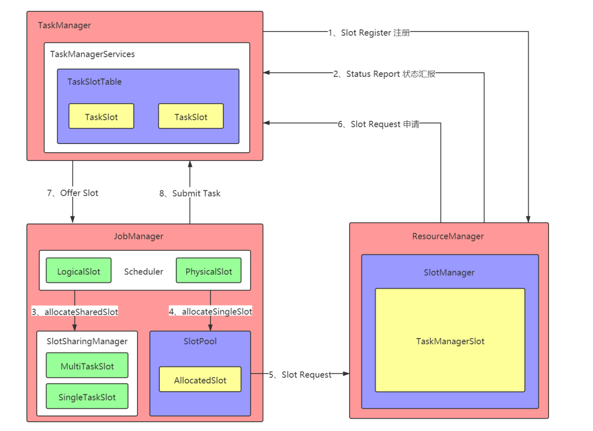

# Flink Slot 管理 和 Task 部署执行详解

## 1. JobMaster 初始化和启动

Flink-1.12 的核心入口：JobManagerRunnerImpl 的构造方法

```java
createJobManagerRunner(JobGraph jobGraph, Configuration configuration,...); 

    return new JobManagerRunnerImpl(jobGraph, ...) 

        // 第一件事：开启选举服务，如果选举成功，则会回调：this.grantLeadership() 方法 
        leaderElectionService.start(this); 

        // 第二件事：创建 JobMaster 服务 
        jobMasterFactory.createJobMasterService(jobGraph, ...) 
```

在 第二件事 的内部，最重要的事情，就是启动 JobMaster 中的 RpcServer，以及将 JobGraph 构建成 ExecutionGraph，入口：JobMaster 的构造方法。

```java
// 第二件事：创建 JobMaster 服务 
jobMasterFactory.createJobMasterService(jobGraph, ...) 

    // 构造 JobMaster 实例 
    new JobMaster(); 

        // TODO_MA 注释： 开启 RPC 服务, 不细讲了 
        super(rpcService, AkkaRpcServiceUtils.createRandomName(JOB_MANAGER_NAME), null); 

        // TODO_MA 注释： 创建一个 SlotPool 对象, 具体实现是： SlotPoolImpl 
        this.slotPool = checkNotNull(slotPoolFactory).createSlotPool(jid); 

        // 目标是创建一个 SchedulerNG 对象，具体实现是：DefaultScheduler 
        // 事实上，该方法内部在构建会调用 SchedulerBase 的构造方法，在该构造方法的内部有一句代码及其重要，就是将 JobGraph 转换成 ExecutionGraph 
        this.schedulerNG = createScheduler(executionDeploymentTracker, jobManagerJobMetricGroup); 

            // 保存 JobGraph 
            this.jobGraph = checkNotNull(jobGraph); 

            // 注意啦：该代码在 SchedulerBase 的构造方法内部，方法作用：将 JobGraph 转换成 ExecutionGraph 
            this.executionGraph = createAndRestoreExecutionGraph(....) 
```

> JobGraph -> ExecutionGraph 是在构造JobMaster的时候完成的

在 第一件事 的内部，针对 JobManagerRunnerImpl 开启了选举服务。当选举成功，就会回调：grantLeadership() 方法。

```java
JobManagerRunnerImpl.grantLeadership(...); 

    // 进行状态校验之后，启动 JobMaster 
    verifyJobSchedulingStatusAndStartJobManager(leaderSessionID);

        // 启动 JobMaster 
        startJobMaster(leaderSessionId); 

            // 将 job 的 RUNNING 状态更新到 ZK 中 
            runningJobsRegistry.setJobRunning(jobGraph.getJobID()); 

            // 启动 JobMaster 的 RpcServer 
            startFuture = jobMasterService.start(new JobMasterId(leaderSessionId)); 

                // 启动 RpcServer 
                start(); 

                // 两件事：主要是 JobMaster 向 ResourceManager 注册，开始申请资源，并且部署Task 
                startJobExecution(newJobMasterId) 

                    // 启动一些基础服务，开始执行 JobMaster 的注册 
                    startJobMasterServices(); 

                        // 第一：启动心跳服务，维持和 ResourceManager 和 TaskManager 之间的心跳 
                        startHeartbeatServices(); 
                        // 第二：启动 Slot 管理组件 
                        slotPool.start(....); 
                        // 第三：联系 ResourceManager 进行注册 
                        reconnectToResourceManager(new FlinkException(....)); 
                        // 第四：监听 ResourceManager 地址的变化 
                        resourceManagerLeaderRetriever.start(new ResourceManagerLeaderListener()); 

                    // 待注册成功之后，进行 slot 申请和 Task 部署 
                    resetAndStartScheduler(); 
```

以上的所有的知识，是在告诉我们：一个 Job 的提交流程，和一个 JobMaster 的初始启动到底做了什么。当这些都做完之后，才真是进入到这个 job 的调度执行


## 2. JobGraph 转换成 ExecutionGraph

核心入口是：SchedulerBase 的构造方法

```java
// 将 JobGraph 转换成 ExecutionGraph 
this.executionGraph = createAndRestoreExecutionGraph(....) 

    // 构建一个 ExecutionGraph 
    ExecutionGraph newExecutionGraph = createExecutionGraph(....) 

        // 将 JobGraph 转换成 ExecutionGraph 
        ExecutionGraphBuilder.buildGraph(..., jobGraph, ...) 

        // 第一步骤：创建一个 ExecutionGraph 
        executionGraph = (prior != null) ? prior : new ExecutionGraph(....) 

        // 第二步骤：生成 JSON 格式的执行计划 
        executionGraph.setJsonPlan(JsonPlanGenerator.generatePlan(jobGraph)); 

        // 第三步骤：从 JobGraph 获取信息，构建 ExecutionGraph 中的 ExecutionVertex 
        for(JobVertex vertex : jobGraph.getVertices()) { 
        	vertex.initializeOnMaster(classLoader); 
        }

        // 第四步骤： 
        List<JobVertex> sortedTopology = jobGraph.getVerticesSortedTopologicallyFromSources(); 
        executionGraph.attachJobGraph(sortedTopology); 

            ExecutionJobVertex ejv = new ExecutionJobVertex(); 

                for(int i = 0; i < numTaskVertices; i++) { 
                    ExecutionVertex vertex = new ExecutionVertex(); 
                } 

        // 第五步骤：处理和生成 checkpoint 有关各种组件和细节 
        JobCheckpointingSettings snapshotSettings = jobGraph.getCheckpointingSettings(); 
        final CheckpointCoordinatorConfiguration chkConfig = snapshotSettings.getCheckpointCoordinatorConfiguration(); 
        executionGraph.enableCheckpointing(chkConfig, triggerVertices, ackVertices, confirmVertices,...)
```

## 3. JobMaster 向 ResourceManager 注册

核心入口：

```java
// 启动一些基础服务，开始执行 JobMaster 的注册 

JobMaster.startJobMasterServices();
```

且看内部细节：总共四件事

```java
// 启动一些基础服务，开始执行 JobMaster 的注册 
JobMaster.startJobMasterServices(); 

    // 启动心跳服务，维持 JobMaster 和 ResourceManager，TaskExecutor 之间的心跳 
    startHeartbeatServices(); 

    // SlotPool 作为 JobMaster 中管理 slot的组件，是非常重要的角色，此时启动，内部主要是启动了三个 定时服务 
    slotPool.start(getFencingToken(), getAddress(), getMainThreadExecutor()); 

    // 联系 ResourceManager 进行注册 
    reconnectToResourceManager(new FlinkException("Starting JobMaster component.")); 

    // 开启监听 ResourceManager 状态的服务，如果监听到 ResourceManager 发生迁移，则 JobMaster 重连 ResourceManager 
    // 这种监听机制，是基于 zookeeper 的 API 框架： curator 来实现的 
    resourceManagerLeaderRetriever.start(new ResourceManagerLeaderListener());
```

第一件事：启动心跳服务：

```java
// 启动心跳服务，维持 JobMaster 和 ResourceManager，TaskExecutor 之间的心跳 
startHeartbeatServices(); 

    // 维持和 TaskExecutor 之间的心跳, 相对于 TaskExecutor 来说，是心跳发送方 
    taskManagerHeartbeatManager = heartbeatServices.createHeartbeatManagerSender(..., new TaskManagerHeartbeatListener(), ...); 

    // 维持 和 ResourceManager 之间的心跳，相对于 ResourceManager，是心跳请求被动接收方 
    resourceManagerHeartbeatManager = heartbeatServices.createHeartbeatManager(.., new ResourceManagerHeartbeatListener(), ...);
```

第二件事：启动 SlotPool 服务

```java
// SlotPool 作为 JobMaster 中管理 slot的组件，是非常重要的角色，此时启动，内部主要是启动了三个 定时服务 
slotPool.start(getFencingToken(), getAddress(), getMainThreadExecutor()); 

    // 第一个定时服务：检测 slot 状态的定时服务，释放长时间不用的 idle slot 
    scheduleRunAsync(this::checkIdleSlot, idleSlotTimeout); 

    // 第二个定时服务：对 PendingRequest 进行超时检测处理 
    scheduleRunAsync(this::checkBatchSlotTimeout, batchSlotTimeout); 

    // 第三个定时服务：定期进行: SlotPool 状态日志输出 
    if(log.isDebugEnabled()) { 
        scheduleRunAsync(this::scheduledLogStatus, STATUS_LOG_INTERVAL_MS, TimeUnit.MILLISECONDS); 
    }
```

第三件事：JobMaster 向 ResourceManager 注册

```java
// 联系 ResourceManager 
reconnectToResourceManager(new FlinkException("Starting JobMaster component.")); 

    // 关闭和已有 ResourceManager 的链接 
    closeResourceManagerConnection(cause); 

    // 建立和新 ResourceManager 的链接 
    tryConnectToResourceManager(); 

        connectToResourceManager(); 

            // 构建链接对象，并发起链接请求 
            resourceManagerConnection = new ResourceManagerConnection(....) 
            resourceManagerConnection.start(); 

                // 创建注册对象，内部创建一个 RetryingRegistration 注册对象，内部实现了: invokeRegistration 方法 
                createNewRegistration(); 

                // 开始注册流程，内部会调用：RetryingRegistration 的 invokeRegistration() 进行注册。 
                // invokeRegistration 方法的内部发送 RPC 注册请求给 ResourceManager 
                newRegistration.startRegistration(); 

                    // RPC 注册请求 
                    resourceManagerGateway.registerJobManager(....); 

                        // 注册内部实现 
                        registerJobMasterInternal(jobMasterGateway, jobId, ...)

                            // 具体注册逻辑实现 
                            JobManagerRegistration jobManagerRegistration = new JobManagerRegistration(...); 

                            jobManagerRegistrations.put(jobId, jobManagerRegistration); 

                            jmResourceIdRegistrations.put(jobManagerResourceId, jobManagerRegistration); 

                            // 维持心跳 
                            jobManagerHeartbeatManager.monitorTarget(....) 

                            // 返回注册响应 
                            return new JobMasterRegistrationSuccess(getFencingToken(), resourceId);
```

当注册成功之后，就会回调：

```java
// 注册回调 
RegisteredRpcConnection.onRegistrationSuccess(); 

    // 内部实现 
    JobMaster.ResourceManagerConnection.onRegistrationSuccess(); 

        establishResourceManagerConnection(success); 

            // SlotPool 去联系 ResourceManager 
            establishedResourceManagerConnection = new EstablishedResourceManagerConnection(...); 
            slotPool.connectToResourceManager(resourceManagerGateway); 

                // 如果有未处理的 PendingRequest 等待 JobMaster 建立和 ResourceManager 之间的链接进行 slot 申请请求处理，此时处理 
                for(PendingRequest pendingRequest : waitingForResourceManager.values()) { 
                    requestSlotFromResourceManager(resourceManagerGateway, pendingRequest); 
                } 

                    // 将其加入：pendingRequests 集合中等待处理 
                    pendingRequests.put(pendingRequest.getSlotRequestId(), allocationId, pendingRequest); 

                    // 然后发出 申请slot 的请求给 ResourceManager 
                    resourceManagerGateway.requestSlot(jobMasterId, new SlotRequest(jobId, allocationId, ...)) 

            // 维持心跳 
            resourceManagerHeartbeatManager.monitorTarget(...)
```

第四件事：开启一个监听服务：监听 ResourceManager 的地址

```java
// 开启监听 ResourceManager 状态的服务，如果监听到 ResourceManager 发生迁移，则 JobMaster 重连 ResourceManager 
DefaultLeaderRetrievalService resourceManagerLeaderRetriever.start(new ResourceManagerLeaderListener()); 

    // 构建一个 LeaderRetrievalDriver 来负责进行监听 
    leaderRetrievalDriverFactory.createLeaderRetrievalDriver(leaderEventHandler:this, ....); 

        // 构建一个基于 zk 的 LeaderRetrievalDriver 
        new ZooKeeperLeaderRetrievalDriver(client, retrievalPath, leaderEventHandler, fatalErrorHandler); 

            // 构造方法内部核心实现 
            this.cache = new NodeCache(client, retrievalPath); 
            cache.getListenable().addListener(this); 
            cache.start(); 
            // 此时，已经开启监听，如果监听响应，由于 cache 的实现是 NodeCache，则回调：this 的 nodeChanged() 方法。 

            // 进入 ZooKeeperLeaderRetrievalDriver 的 nodeChanged() 方法 
            ZooKeeperLeaderRetrievalDriver.nodeChanged(); 

                // 接收到新的地址信息 
                retrieveLeaderInformationFromZooKeeper(); 

                    // 获取新的地址信息 
                    final ChildData childData = cache.getCurrentData(); 

                    // 通知该新的地址信息 
                    // 注意：leaderRetrievalEventHandler 就是 DefaultLeaderRetrievalService 
                    leaderRetrievalEventHandler.notifyLeaderAddress(....) 

                        // 所以：回到 DefaultLeaderRetrievalService 
                        DefaultLeaderRetrievalService.notifyLeaderAddress(....) 

                            // leaderListener = ResourceManagerLeaderListener 
                            leaderListener.notifyLeaderAddress(newLeaderAddress, newLeaderSessionID); 

                                // ResourceManagerLeaderListener 
                                ResourceManagerLeaderListener.notifyLeaderAddress(....) 

                                    // ResourceManagerLeaderListener.notifyOfNewResourceManagerLeader() 
                                    ResourceManagerLeaderListener.notifyOfNewResourceManagerLeader() 

                                        // 重连 ResourceManager
                                        reconnectToResourceManager() 
```


## 4. JobMaster 注册成功之后开始调度

调度的核心入口是：

```java
// 开始调度执行 
JobMaster.resetAndStartScheduler();
```

且看详细实现：

```java
// 开始调度执行 
JobMaster.resetAndStartScheduler(); 

    // 开始调度 
    JobMaster.startScheduling(); 

        // 由当前调用关系，可知，DefaultScheduler 是真正完成 JobMaster 的 Task 的slot申请 和 部署运行的 
        SchedulerBase.startScheduling(); 

            // 启动 OperatorCoordinator 
            DefaultScheduler.startAllOperatorCoordinators(); 

            // 继续调度 
            DefaultScheduler.startSchedulingInternal(); 

                // 准备 ExecutionGraph 用于调度 
                prepareExecutionGraphForNgScheduling(); 

                    // 更改 Job 的状态为 RUNNING 
                    executionGraph.transitionToRunning(); 

                // 通过 SchedulingStrategy 来执行调度：schedulingStrategy = EagerSchedulingStrategy 
                schedulingStrategy.startScheduling(); 

                    // 申请 slot 和部署 Task 
                    // 参数是所有 ExecutionVertex 的 ID 集合 
                    allocateSlotsAndDeploy(SchedulingStrategyUtils.getAllVertexIdsFromTopology(schedulingTopology)); 

                        // 根据 ExecutionVertexID 为每个 ExecutionVertex 获取 DeploymentOption 部署信息 
                        schedulerOperations.allocateSlotsAndDeploy(executionVertexDeploymentOptions); 

                            // 第一件大事：申请 slot 
                            slotExecutionVertexAssignments = allocateSlots(executionVertexDeploymentOptions); 

                            // 第二件大事：进行部署 
                            waitForAllSlotsAndDeploy(deploymentHandles);
```

至此，JobMaster 启动之后，终于开始 申请 Slot 和 部署 Task 了。


## 5. Flink 的资源资源管理机制

  

大体流程如下：

+ TaskExecutor 注册
  + Reqister : 当 TaskExecutor 启动之后，会向 ResourceManager 注册自己和自己内部的 Slot。
  + Status Report：TaskExecutor 启动之后，会定期向 ResourceManager 进行心跳汇报，在心跳 payload 中，会携带 Slot 信息，ResourceManager 会随即更新自己内部 Slot 状态。

+ JobMaster/JobManager 内部分配
  + allocateSingleSlot : Scheduler 向 Slot Pool 发送请求，如果 Slot 资源足够则直接分配，如果 Slot 资源不够，则由 Slot Pool 再向 SlotManager发送请求，此时即为 Job 向 Cluster 请求资源
  + allocateSharedSlot : Scheduler 向 Slot Sharing Manager 发送请求，Slot Sharing Manager 构建好 Slot 树之后， 向 Slot Pool 发送请求，如果 Slot 资源足够则直接分配，如果 Slot 资源不够，则由 Slot Pool 再向 Slot Manager发送请求，此时即为 Job 向 Cluster 请求资源

> JobManager（JobMaster）如何决定一个Job到底需要多少Slot

+ Job 向 Cluster 请求资源

  + 如果 Slot Manager 判断集群当中有足够的资源可以满足需求，那么就会向 Task Manager 发送 Request 指令，Slot Pool 再去满足 Scheduler的资源请求。

  + 在 Active Resource Manager 资源部署模式下，当 Resource Manager 判定 Flink Cluster 中没有足够的资源去满足需求时，它会进一步去底层的资源调度系统请求资源，由调度系统把新的 Task Manager 启动起来，并且 TaskManager 向 Resource Manager 注册，则完成了新 Slot的补充。

+ TaskExecutor Offer Slot
  + Offer : Task Manager 就会提供 Slot 给 Slot Pool。

+ JobMaster/JobManager 会向 TaskExecutor 提交 Task
  + submitTask : JobMaster/JobManager 会更新内部 Slot 状态，然后向 TaskExecutor 提交任务。

关于上图中，涉及到的一些概念：

+ TaskSlot 是 TaskExecutor 中对物理资源的封装

+ SlotOffer 是一个中间环节，和 TaskSlot 一一对应，TaskExecutor 用它来向 JobMaster/JobManager 提交 Slot

+ SingleTaskSlot 是共享 Slot 树中的叶子结点，和 SlotOffer 一一对应。

+ MultiTaskSlot 是共享 Slot 树的中间节点

+ SingleLogicalSlot 是一个 Slot 的逻辑抽象，由 SingleTaskSlot 生成，并一一对应

+ Execution#assignedResource 成员变量指向 SingleLogicalSlot，并一一对应

+ TaskManagerSlot 是 ResourceManager 中对 TaskExecutor 的 TaskSlot 的状态记录/管理，TaskManagerSlot 和 TaskSlot 一一对应


## 6. Flink 的 Slot 申请

首先看图说话：

 

Flink 的 slot 管理分为 3个部分：

+ ResourceManager，ResourceManager 是资源管理者，通过 SlotManager 进行 slot 管理

  + 负责处理 TaskExecutor 的 Slot 注册 和 Slot 汇报

  + 接收到 JobMaster 的申请 slot 的请求，然后向 TaskExecutor 发送 RPC 请求申请 slot

+ TaskExecutor，TaskExecutor 是资源提供者，通过 SlotTable 进行 slot 管理

  + TaskExecutor 上线之初，会找 ResourceManager 进行 slot 注册，而后，在心跳过程中，不停进行 SlotStatus 和 Payload 的 Report

  + TaskExecutor 接收到 ResourceManager 的分派 Slot 的 RPC 请求之后，完成 slot 分派，并且告知 JobMaster

+ JobMaster，JobMaster 是资源使用者，通过 SlotPool 进行 Slot 管理

  + JobMaster 负责向 ResourceManager 申请 slot，或者取消申请

  + JobMaster 会接收来自 TaskExecutor 的 slot 的分派完成，然后部署 Task 执行，当 Task 执行完毕之后，会释放 Slot

关于 Flink 中 slot 的申请和释放的 RPC 调用关系：

1.TaskExecutor 上线之初，通过 sendSlotReport 向 ResourceManager 注册 Slot

2.JobMaster 启动之后，通过 requestSlot 向 ResourceManager 申请 slot，申请期间，也可以通过 cancelSlotRequest 取消申请

3.ResourceManager 接收到 JobMaster 的 slot 请求，会通过 requestSlot 将请求转发给 TaskExecutor

4.TaskExecutor 接收到 ResourceManager 的 requestSlot 请求之后完成 slot 分派，然后通过 offerSlot 告知 JobMaster

5.JobMaster 在使用完毕 slot 之后，会通过 freeSlot 向 TaskExecutor 释放 slot

6.TaskExecutor 在接收到一个 freeSlot 请求之后，会通过 notifySlotAvailable 告知 ResourceManager 该 slot 可用

JobMaster 申请 slot 的核心入口：

```
allocateSlots(executionVertexDeploymentOptions); 
```

大体上，分为四个大步骤：

```
1、JobMaster 发送请求申请 slot 的请求给 ResourceManager 
2、ResourceManager 接收到请求，执行 slot 分派处理，然后转发请求给 TaskExecutor 
3、TaskExecutor 处理 ResourceManager 发送过来的 Slot 请求，完成 Slot 分派 
4、JobMaster 接收到 TaskExecutor 发送过来的 Slot 申请处理结果 
```


## 7. JobMaster 向 ResourceManager 申请 Slot

```java
// JobMaster 发送请求申请 slot 
DefaultScheduler.allocateSlots(); 

    DefaultExecutionSlotAllocator.allocateSlotsFor(); 

        // 调度策略事先：NormalSlotProviderStrategy 
        NormalSlotProviderStrategy.allocateSlot(); 

            SchedulerImpl.allocateSlot(); 

                SchedulerImpl.allocateSlotInternal(); 

                    SchedulerImpl.internalAllocateSlot(); 

                        SchedulerImpl.allocateSharedSlot(); 

                            SchedulerImpl.allocateMultiTaskSlot();

                                // 先尝试从 可用的 slot 中去申请 
                                SchedulerImpl.tryAllocateFromAvailable(...) 

                                // 申请不到，再向 ResourceManager 去申请 
                                SchedulerImpl.requestNewAllocatedSlot(); 

                                    SlotPoolImpl.requestNewAllocatedBatchSlot(); 

                                    // 创建一个 PendingRequest 
                                    final PendingRequest pendingRequest = PendingRequest.createStreamingRequest(...) 
                                    // PendingRequest 是存在于 JobMaster 中的， PendingSlotRequest 是存在于 ResourceManager 中 

                                    // 发送 PendingRequest 给 ResourceManager 
									SlotPoolImpl.requestNewAllocatedSlotInternal(pendingRequest); 
                                    			
                                        SlotPoolImpl.requestSlotFromResourceManager(resourceManagerGateway, pendingRequest); 

                                            // 将 PendingRequest 加入到 JobMaster 中的 slotPool 中的 pendingRequests 集合中 
                                            pendingRequests.put(slotRequestId, allocationId, pendingRequest); 

                                            // 发送 RPC 请求给 ResourceManager 
                                            rmResponse = resourceManagerGateway.requestSlot(jobMasterId, new SlotRequest()); 
```

大体上来说，JobMaster 中的负责 Slot 管理的 SlotPool 封装一个 PendingRequest，然后发送 RPC 请求向 ResourceManager 申请 slot。 

## 8. ResourceManager 向 TaskExecutor 申请 Slot

```java
// ResourceManager 接收到请求，执行 slot请求处理 
ResourceManager.requestSlot(); 

    // 往 SlotManagerImpl 中注册一个 Slot 申请的请求 
    SlotManagerImpl.registerSlotRequest(); 

        // 将 SlotRequest 封装成 PendingSlotRequest，加入到 pendingSlotRequests 集合 
        PendingSlotRequest pendingSlotRequest = new PendingSlotRequest(slotRequest); 
        pendingSlotRequests.put(slotRequest.getAllocationId(), pendingSlotRequest); 

            // 通过 SlotManagerImpl 执行该请求 
            SlotManagerImpl.internalRequestSlot(pendingSlotRequest); 

                // 申请 slot 
                SlotManagerImpl.allocateSlot(); 

                    // 转发请求给 TaskExecutor 
                    TaskExecutorGateway.requestSlot(); 

                    // 接收到 RPC 响应之后，更改 Slot 的状态 
                    updateSlot(slotId, allocationId, pendingSlotRequest.getJobId()); 

                        // 更改 slot 的状态 
                        updateSlotState(slot, taskManagerRegistration, allocationId, jobId); 

                            // 完成状态更改 
                            slot.completeAllocation(allocationId, jobId); 

                                // slot 的状态变成：ALLOCATED 
                                state = SlotState.ALLOCATED; 
```


## 9. TaskExecutor 完成 Slot 分派

```java
// TaskManager 处理 ResourceManager 发送过来的 Slot 请求 
TaskExecutor.requestSlot(); 

    // 完成物理分派的一个动作！ 
    allocateSlot(slotId, jobId, allocationId, resourceProfile); 

        // JobMaster 在完成一些处理之后，开始向 JobMaster 汇报 
        TaskExecutor.offerSlotsToJobManager(); 

            // 调用内部实现 
            TaskExecutor.internalOfferSlotsToJobManager(); 

                // 通过 RPC 调用，将 slot 提供给 JobMaster 
                JobMasterGateway.offerSlots(SlotOffer);

                    // JobMaster 会有反馈发送过来 
                    handleAcceptedSlotOffers(jobId, jobMasterGateway, jobMasterId, reservedSlots); 

                        // 第一种情况： 如果超时 
                        handleAcceptedSlotOffers(jobId, jobMasterGateway, jobMasterId, reservedSlots); 

                            // 如果超时，就重试 
                            // TaskExecutor.offerSlotsToJobManager(); 
                            // JobMasterGateway.offerSlots(); 
                            offerSlotsToJobManager(jobId); 

                        // 第二种情况： 如果不是超时异常，则释放该 slot 
                        freeSlotInternal(reservedSlot.getAllocationId(), throwable); 

                        // 第三种情况： 如果接受成功，则标记 slot 为 active 
                        taskSlotTable.markSlotActive(acceptedSlot.getAllocationId()); 

                            // 如果标记失败，向 JobMaster 发送失败消息 
                            jobMasterGateway.failSlot(...); 

                        // 第四种情况： 如果接受失败，则释放 slot 
                        freeSlotInternal(rejectedSlot.getAllocationId(), e); 
```


## 10. TaskExecutor 向 JobMaster 汇报 Slot

```java
// JobMaster 接收到 TaskManager 发送过来的 Slot 申请处理结果 
JobMaster.offerSlots(...); 

    // 内部调用 SlotPoolImpl 进行处理 
    SlotPoolImpl.offerSlots(...); 

        // 完成所有 Slot 的 offer 处理 
        for(SlotOffer offer : offers) { 
            // JobMaster 完成接受的逻辑 
            if(offerSlot(taskManagerLocation, taskManagerGateway, offer)) { 
                result.add(offer); 
            } 
        } 

            // 完成一个 Slot 的 offer 
            SlotPoolImpl.offerSlot(...); 

                // 生成一个 AllocatedSlot 
                final AllocatedSlot allocatedSlot = new AllocatedSlot(allocationID, ....) 

                // 用这个 AllocatedSlot 去满足 PendingRequest 
                tryFulfillSlotRequestOrMakeAvailable(allocatedSlot); 

                    // 找到适配的 PendingRequest 
                    final PendingRequest pendingRequest = findMatchingPendingRequest(allocatedSlot); 

                    // 移除 PendingRequest 
                    removePendingRequest(pendingRequest.getSlotRequestId()); 
```


## 11. JobMaster 部署 Task

这个知识点，就是告诉你，一个 Flink Job 中的每一个 Task 到底都是怎么启动起来的，但是今天不涉及到 Task 的具体执行细节！

核心入口是：

```
DefaultScheduler.waitForAllSlotsAndDeploy(deploymentHandles); 
```

详细流程：

```java
// DefaultScheduler 完成 Task 调度派发 
DefaultScheduler.waitForAllSlotsAndDeploy(); 

    // 部署所有 Task 
    DefaultScheduler.deployAll(); 

        // 部署一个 Task 
        DefaultScheduler.deployOrHandleError(); 

            DefaultScheduler.deployTaskSafe(); 

                // 部署一个 ExecutionVertex
                DefaultExecutionVertexOperations.deploy(); 

                    ExecutionVertex.deploy(); 

                    // 其实，一个 ExecutionVertex 部署运行的时候，最终是生成一个 Execution 部署运行 
                    // 请注意： ExecutionVertex 运行一次，就生成一个 Execution 
                    Execution.deploy(); 

                        // 构建一个部署描述对象：TDD（TaskDeploymentDescriptor），封装部署 Task 运行时所需要的各种信息 
                        TaskDeploymentDescriptorFactory.createDeploymentDescriptor(); 

                            // 提交 Task 
                            RpcTaskManagerGateway.submitTask(); 

                                // 发送部署 Task 的 RPC 请求，给对应的 TaskExecutor 
                                TaskExecutor.submitTask(); 
```


## 12. TaskExecutor 启动 Task

```java
// TaskExecutor 接到 submitTask RPC 请求：TaskDeploymentDescriptor 
TaskExecutor.submitTask(); 

    // 构造 Task 实例对象 
    Task task = new Task(....) 

    // 启动 Task 中的 executingThread 来执行 Task 
    task.startTaskThread(); 

        Task.run() 

            Task.doRun(); 

                // 1、先更改 Task 的状态： CREATED ==> DEPLOYING 
                transitionState(ExecutionState.CREATED, ExecutionState.DEPLOYING) 

                // 2、准备 ExecutionConfig，当前 Task 部署的时候所需要的参数对象 
                final ExecutionConfig executionConfig = serializedExecutionConfig.deserializeValue(userCodeClassLoader); 

                // 3、初始化输入和输出组件 
                setupPartitionsAndGates(consumableNotifyingPartitionWriters, inputGates); 

                // 4、注册 输出 
                for(ResultPartitionWriter partitionWriter : consumableNotifyingPartitionWriters) { 
                    taskEventDispatcher.registerPartition(partitionWriter.getPartitionId()); 
                }

                // 5、从分布式缓存中，拷贝下来一些运行 Task 所需要的资源文件 
                DistributedCache.readFileInfoFromConfig(jobConfiguration); 

                // 6、初始 环境对象 RuntimeEnvironment 
                Environment env = new RuntimeEnvironment(jobId, vertexId, executionId, ....) 

                // 7、初始化 调用对象 
                // 两种最常见的类型： SourceStreamTask、OneInputStreamTask、TwoInputStreamTask 
                // 父类： StreamTask 
                AbstractInvokable invokable = loadAndInstantiateInvokable(userCodeClassLoader,nameOfInvokableClass, env); 

                // 8、保存该启动实例 
                this.invokable = invokable; 

                // 9、先更改 Task 的状态： DEPLOYING ==> RUNNING 
                transitionState(ExecutionState.DEPLOYING, ExecutionState.RUNNING) 

                // 10、Task 切换进入 RUNNING 状态， 并告知 JobMaster 
                taskManagerActions.updateTaskExecutionState(new TaskExecutionState(jobId, executionId, ExecutionState.RUNNING)); 

                // 11、真正把 Task启动起来了 
                invokable.invoke(); 

                // 正常来说，后面这两个步骤是不执行的！ 
                // 但是涉及到比如 savepoint 的动作操作时，那就肯定会执行到 
                // 12、ResultPartitionWriter 完成所有 还未 flush 的数据的 flush 动作 
                for(ResultPartitionWriter partitionWriter : consumableNotifyingPartitionWriters) { 
                    if(partitionWriter != null) { 
                        partitionWriter.finish(); 
                    } 
                }

                // 13、先更改 Task 的状态： RUNNING ==> FINISHED 
                transitionState(ExecutionState.RUNNING, ExecutionState.FINISHED) 
```

到此为止，当 invokable.invoke(); 执行的时候，Task 就真正执行起来了。
