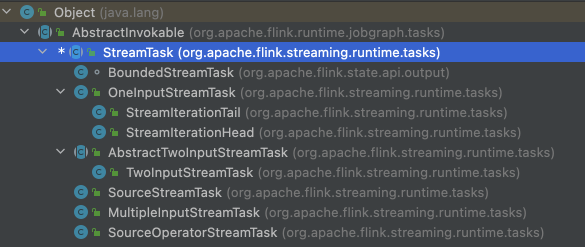
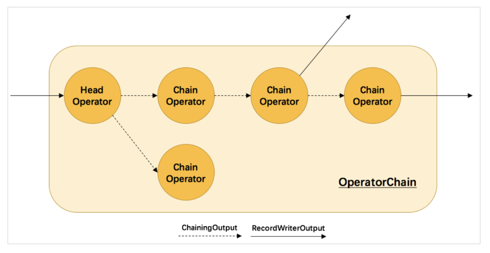

# StreamTask 初始化、执行和数据流转详解

## 1. StreamTask 部署启动

### 1.1. TaskExecutor 部署启动一个 Task

当 TaskExecutor 接收提交 Task 执行的请求，则调用：

```java
// 调度链条:JobMaster --> DefaultScheduler --> SchedulingStrategy --> ExecutionVertex --> Execution --> RPC请求 --> TaskExecutor
// 根据 Slot 找到 TaskExecutor，然后 taskManagerGateway.submitTask(tdd) 
TaskExecutor.submitTask(TaskDeploymentDescriptor tdd, JobMasterId jobMasterId, Time timeout);
```

最重要的一些细节动作：

```java
// 首先将 TaskSlot 的状态修改为 Active，然后取消 Slot 的使用超时任务:Timeout 
taskSlotTable.tryMarkSlotActive(jobId, tdd.getAllocationId())
    taskSlot.markActive()
    timerService.unregisterTimeout(taskSlot.getAllocationId());

// 从 BlobService 下载 Task 执行需要的各种资源
// 有一个文件存储在HDFS: 文件内容，文件存储在HDFS上的一些秒数据 
tdd.loadBigData(blobCacheService.getPermanentBlobService());

// 构造 Task 对象（线程）
Task task = new Task(jobInformation, taskInformation, ExecutionAttemptId, AllocationId, SubtaskIndex, ....);

// 启动 Task 的执行 
task.startTaskThread();
```

> 可以看出：一个Task提交到TaskManager运行的时候，是以一个线程的方式运行的

在该方法的内部，会封装一个 Task 对象，在 Task 的构造方法中，也做了一些相应的初始化动作，我们来看：

```java
public Task(.....){ 
    // 第一件事
    // 封装一个 Task信息对象 TaskInfo，(TaskInfo, JobInfo，JobMasterInfo) 
    this.taskInfo = new TaskInfo(....);
    
    // 各种成员变量赋值 
    ......
        
    // 第二件事:初始化 ResultPartition 和 ResultSubPartition
    // 一个Task的执行有输出管理:关于输出的抽象: ResultPartition 和ResultSubPartition(PipelinedSubpartition)
    // 初始化 ResultPartition 和 ResultSubPartition
    ResultPartitionWriter[] resultPartitionWriters = shuffleEnvironment.createResultPartitionWriters(....);
        resultPartitionFactory.create(ownerContext.getOwnerName(), partitionIndex, ...);
            // 创建 ResultPartition = PipelinedResultPartition
            ResultSubpartition[] subpartitions = new ResultSubpartition[numberOfSubpartitions]; 
            final PipelinedResultPartition pipelinedPartition = new PipelinedResultPartition(....)
                // 创建 ResultSubPartition = PipelinedSubpartition
                ResultSubpartition[] subpartitions = new ResultSubpartition[numberOfSubpartitions]; 
                subpartitions[i] = PipelinedSubpartition::new;
    
                
    // 将生成的 PipelinedSubpartition 包装成 ConsumableNotifyingResultPartitionWriter 
    // 其实就是多增加了一个 ResultPartitionConsumableNotifier 功能
    this.consumableNotifyingPartitionWriters=ConsumableNotifyingResultPartitionWriterDecorator.decorate(resultPartitionWriters);
           
    // 第三件事:初始化 InputGate 和 InputChannel
    // 一个Task的执行也有输入的管理:关于输入的抽象:InputGate 和 InputChannel(从上有一个Task节点拉取数据)
    // InputChannel 可能有两种实现: Local Remote
    // 初始化 InputGate 和 InputChannel
    final IndexedInputGate[] gates = shuffleEnvironment.createInputGates(taskShuffleContext, .....);
        // 创建 InputGate = SingleInputGate
        SingleInputGate[] inputGates = new SingleInputGate[inputGateDeploymentDescriptors.size()]; 
        for(int gateIndex = 0; gateIndex < inputGates.length; gateIndex++) {
            SingleInputGate inputGate = singleInputGateFactory.create(....); 
                SingleInputGate inputGate = new SingleInputGate(....)
                // 创建 InputChannel
                createInputChannels(owningTaskName, igdd, inputGate, metrics);
                    InputChannel[] inputChannels = new InputChannel[shuffleDescriptors.length];
                    for(int i = 0; i < inputChannels.length; i++) {
                        inputChannels[i] = createInputChannel(inputGate, i, shuffleDescriptors[i], channelStatistics, metrics);
                    }
                    // 设置 inputGate 和 inputChannels 之间的关系, 其实是和 分区的 关系
                    inputGate.setInputChannels(inputChannels);
            inputGates[gateIndex] = inputGate;
        }
    
    // 第四件事:通过一个线程的方式来启动Task
    // 初始化一个用来执行 Task 的线程，目标对象，就是 Task 自己
    executingThread = new Thread(TASK_THREADS_GROUP, this, taskNameWithSubtask);
}
```

封装一个 Task 的时候，调用构造方法执行，会去初始化该 Task 的输入（InputGate 和 InputChannel）和输出（ResultPartition 和ResultSubPartition）组件相关。然后初始化用来执行该 Task 的一个线程。

总之，都是通过封装一个 Task 对象，内含一个 executingThread，它的目标对象，就是 Task，所以在构造好了 Task 之后，调用：

```java
task.startTaskThread();
```

之后，跳转到 Task.run() 方法，从此，真正开始一个 Task 的启动和执行。

在这个过程中，注意复习一个要点：在 TaskExecutor 初始化之前，会先初始化得到一个关于各种基础服务的一个封装对象 TaskManagerServices。而在TaskManagerServices 内部最重要的就是去创建了一个 NettyShuffleEnvironment 来负责这个 TaskManager 之上运行的各种 Task 的数据传输任务。最重要的事情，其实是：创建了一个 NettyConnectionManager 和 NetworkBufferPool。而在创建 NettyConnectionManager 实例的内部，创建了NettyServer 和 NettyClient。大致用伪代码表示一下这个逻辑：

```java
TaskManagerServices.fromConfiguration();
    // 创建得到 NettyShuffleEnvironment
    ShuffleEnvironment<?, ?> shuffleEnvironment = createShuffleEnvironment();
        ShuffleEnvironmentContext shuffleEnvironmentContext = new ShuffleEnvironmentContext();
        ShuffleServiceLoader.loadShuffleServiceFactory(conf).createShuffleEnvironment(context);
            createNettyShuffleEnvironment(); 
                // 内部具体实现!
                createNettyShuffleEnvironment();
                    NettyConfig nettyConfig = config.nettyConfig();
                    FileChannelManager fileChannelManager = new FileChannelManagerImpl(config.getTempDirs(), DIR_NAME_PREFIX);

                    // 创建得到:NettyConnectionManager
                    connectionManager = nettyConfig != null ? new NettyConnectionManager():new LocalConnectionManager();
                        // 初始化得到一个 NettyServer
                        this.server = new NettyServer(nettyConfig);
                        // 初始化得到一个 NettyClient
                        this.client = new NettyClient(nettyConfig);
                        // 初始化一个内存 BufferPool
                        this.bufferPool = new NettyBufferPool(nettyConfig.getNumberOfArenas());
                        // 封装了 NettyClient 的一个存在于下游 Task 的 Netty 通信客户端 
                        this.partitionRequestClientFactory = new PartitionRequestClientFactory(...); 
                        // Netty Server 和 Client 通信协议
                        this.nettyProtocol = new NettyProtocol();

                    // 用于管理申请到的固定数量的 MemorySegment 的 BufferPool 
                    NetworkBufferPool networkBufferPool = new NetworkBufferPool();

                    // 创建 ResultPartition Factory
                    ResultPartitionFactory resultPartitionFactory = new ResultPartitionFactory();

                    // 创建 InputGate Factory
                    SingleInputGateFactory singleInputGateFactory = new SingleInputGateFactory(); 
                    return new NettyShuffleEnvironment(....);
```

注意：NettyProtocol 的内部的两个方法：分别用来获取 Netty 的 Server 端的 Handler 和 Client 的 Handler

```java
// NettyServer 的 Handler
public ChannelHandler[] getServerChannelHandlers() {
    PartitionRequestQueue queueOfPartitionQueues = new PartitionRequestQueue();
    PartitionRequestServerHandler serverHandler = new PartitionRequestServerHandler(...., queueOfPartitionQueues);
    return new ChannelHandler[]{messageEncoder, messageDecoder(), serverHandler, queueOfPartitionQueues};
}
// NettyClient 的 Handler
public ChannelHandler[] getClientChannelHandlers() {
    NetworkClientHandler networkClientHandler = new CreditBasedPartitionRequestClientHandler();
    return new ChannelHandler[]{messageEncoder, new NettyMessageClientDecoderDelegate(...), networkClientHandler};
}
```

总结：

然后在 Task 的构造方法内部，重点做四件事：

```java
// 1、创建 ResultPartitionWriter，其实就是 ResultPartition，负责该 Task 的输出管理
ResultPartitionWriter[] resultPartitionWriters = shuffleEnvironment.createResultPartitionWriters(...);

// 2、创建 ConsumableNotifyingResultPartitionWriterDecorator，用于给下游 Task 发送有可消费数据的一个通知器 
this.consumableNotifyingPartitionWriters = ConsumableNotifyingResultPartitionWriterDecorator.decorate(...);

// 3、创建 InputGate，其实就是 SingleInputGate，负责该 Task 的输入管理 
IndexedInputGate[] gates = shuffleEnvironment.createInputGates(...);

// 4、创建一个 executingThread，用来执行该 Task
executingThread = new Thread(TASK_THREADS_GROUP, this, taskNameWithSubtask);
```

所以当 Task 的构造方法完毕之后，自然就会启动 Task 的执行，然后跳转到 run() 去启动 Task

关于 ReusltPartition 的初始化：

```java
ResultSubPartition = PipelinedSubpartition 
ResultPartition = PipelinedResultPartition
```

关于 InputGate 的初始化：

```java
InputGate = SingleInputGate
IntputChannel = LocalInputChannel RemoteInputChannel
```

### 1.2. Task 线程启动

Task 的启动，是通过启动 Task 对象的内部 executingThread 来执行 Task 的，具体逻辑在 run 方法中：

```java
Task.run()
    Task.doRun();
    
        // 1、先更改 Task 的状态: CREATED ==> DEPLOYING 
        transitionState(ExecutionState.CREATED, ExecutionState.DEPLOYING)
            
        // 2、准备 ExecutionConfig，当前 Task 部署的时候所需要的参数对象
        final ExecutionConfig executionConfig = serializedExecutionConfig.deserializeValue(userCodeClassLoader);
    
        // 3、初始化输入和输出组件 
        setupPartitionsAndGates(consumableNotifyingPartitionWriters, inputGates);
    
        // 4、注册 输出
        for(ResultPartitionWriter partitionWriter : consumableNotifyingPartitionWriters) {
            taskEventDispatcher.registerPartition(partitionWriter.getPartitionId());
        }
    
        // 5、从分布式缓存中，拷贝下来一些运行 Task 所需要的资源文件 
        DistributedCache.readFileInfoFromConfig(jobConfiguration);
    
        // 6、初始 环境对象 RuntimeEnvironment
        Environment env = new RuntimeEnvironment(jobId, vertexId, executionId, ....)
            
        // 7、初始化 调用对象
        // 两种最常见的类型: SourceStreamTask、OneInputStreamTask、TwoInputStreamTask
        // 父类: StreamTask
        // 通过反射实例化 StreamTask 实例(可能的两种情况: SourceStreamTask， OneInputStreamTask)
        AbstractInvokable invokable = loadAndInstantiateInvokable(userCodeClassLoader, nameOfInvokableClass, env);
    
        // StreamGraph 的 addOperator() 方法的内部有一句代码:是来确定具体的 StreamTask 到底是那种类型
        // invokableClass = operatorFactory.isStreamSource() ? SourceStreamTask.class : OneInputStreamTask.class; 
        // SourceStreamTask --> OneInputStreamTask --> OneInputStreamTask --> OneInputStreamTask
        // 8、保存该启动实例 
        this.invokable = invokable;
    
        // 9、先更改 Task 的状态: DEPLOYING ==> RUNNING 
        transitionState(ExecutionState.DEPLOYING, ExecutionState.RUNNING)
            
        // 10、Task 切换进入 RUNNING 状态， 并告知 JobMaster
        taskManagerActions.updateTaskExecutionState(new TaskExecutionState(jobId, executionId, ExecutionState.RUNNING));
    
        // 11、真正把 Task启动起来了 
        invokable.invoke();
    
        // 正常来说，后面这两个步骤是不执行的!
        // 但是涉及到比如 savepoint 的动作操作时，那就肯定会执行到
    
        // 12、ResultPartitionWriter 完成所有 还未 flush 的数据的 flush 动作 
        for(ResultPartitionWriter partitionWriter : consumableNotifyingPartitionWriters) {
            if(partitionWriter != null) {
                partitionWriter.finish();
            } 
        }
    
        // 13、先更改 Task 的状态: RUNNING ==> FINISHED 
        transitionState(ExecutionState.RUNNING, ExecutionState.FINISHED)
```

根据上述代码的执行可知：一个 Task 的状态周期：

```java
CREATED ---> DEPLOYING -----> RUNNING  ----> FINISHED
```

内部通过反射来实例化 AbstractInvokable 的具体实例，最终跳转到 SourceStreamTask 的构造方法，同样，如果是非 SourceStreamTask 的话，则跳转到 OneInputStreamTask 的带 Environment 参数的构造方法。


## 2. StreamTask 初始化

这个地方的初始化，指的就是 SourceStreamTask 和 OneInputStreamTask 的实例对象的构建！

Task 这个类，只是一个笼统意义上的 Task，就是一个通用 Task 的抽象，不管是批处理的，还是流式处理的，不管是源 Task， 还是逻辑处理 Task， 都

被抽象成 Task 来进行调度执行！

 

### 2.1. SourceStreamTask 和 OneInputStreamTask 初始化

启动一个 Task 的执行，这个 Task 有可能是 SourceStreamTask，也有可能是非 SourceStreamTask（比如 OneInputStreamTask，TwoInputStreamTask）等。

首先需要了解的第一个知识点：在最开始一个 job 提交到 Flink standalone 集群运行的时候，在 client 构建 StreamGraph（顶点是 StreamNode，边是StreamEdge） 的时候，会根据用户调用的算子生成的 Transformation 为 StreamGraph 生成 StreamNode，在生成 StreamNode 的时候，会通过OpearatorFactory 执行判断：

+ 如果该 StreamOperator 是 StreamSource 的话，就会指定该 StreamTask 的 invokableClass 为 **SourceStreamTask**

+ 否则为 **OneInputStreamTask**，TwoInputStreamTask， StreamTask 等。

核心代码是：

```java
StreamGraph.addOperator(....){
    invokableClass = operatorFactory.isStreamSource() ? SourceStreamTask.class : OneInputStreamTask.class;
}
```

所以当 ExecutionVertex 真正被提交到 TaskExecutor 中运行的时候，被封装的 Execution 对应的 Task 类的启动类 AbstractInvokable 就是在构建StreamGraph 的时候指定的对应的 invokableClass。所以：

```java
1、如果启动 SourceStreamTask，则启动类是：SourceStreamTask 
    2、如果启动非 SourceStreamTask，则启动类是：StreamTask
```

所以咱们首先来看 SourceStreamTask 的构造过程。来看 SourceStreamTask 的构造方法：

```java
public SourceStreamTask(Environment env) throws Exception { 
    this(env, new Object()); 
}
```

然后跳转到重载构造：

```java
public SourceStreamTask(Environment env) throws Exception {
    this(env, new Object());
}

private SourceStreamTask(Environment env, Object lock) throws Exception {
    // 调用 StreamTask 的构造方法
    super(env, null, FatalExitExceptionHandler.INSTANCE, StreamTaskActionExecutor.synchronizedExecutor(lock)); 
    this.lock = Preconditions.checkNotNull(lock);
    
    // 这是 source 用于产生 data 的一个线程
    this.sourceThread = new LegacySourceFunctionThread();
}
```

我们首先来看 StreamTask 的具体构造方法的实现：

```java
protected StreamTask(Environment environment, @Nullable TimerService timerService, Thread.UncaughtExceptionHandler
uncaughtExceptionHandler, StreamTaskActionExecutor actionExecutor, TaskMailbox mailbox) throws Exception {
    .......
    
    // StrewamTask(ResultPartition + InputGate)
    // 创建 RecordWriter, 大概率是:ChannelSelectorRecordWriter， 也有可能是个 BroadcastRecordWriter 
    this.recordWriter = createRecordWriterDelegate(configuration, environment);
    
    // 初始化 StreamTask 的时候，初始化 MailboxProcessor， 同时，执行 StreamTask 的 processInput() 方法 
    // 如果为 SourceStreamTask 的话，processInput 方法会启动 SourceStreamTask 的 sourceThread
    // Mail MailBox MailboxProcessor, mailboxProcessor 当中有一个方法叫做: processMail(mail) 
    this.mailboxProcessor = new MailboxProcessor(this::processInput, mailbox, actionExecutor);
    
    // 创建 StateBackend，按照我们的配置，一般获取到的是 FsStateBackend 
    this.stateBackend = createStateBackend();
    
    // 初始化 SubtaskCheckpointCoordinatorImpl 实例，主要作用是通过 StateBackend 创建 CheckpointStorage 
    this.subtaskCheckpointCoordinator = new SubtaskCheckpointCoordinatorImpl(
    
        // 创建 CheckpointStorage, 使用 FsStateBackend 的话，创建的就是 FsCheckpointStorage 
        stateBackend.createCheckpointStorage(getEnvironment().getJobID()), getName(), actionExecutor, getCancelables(), getAsyncOperationsThreadPool(), getEnvironment(), this, configuration.isUnalignedCheckpointsEnabled(), this::prepareInputSnapshot);
        
    ......
}
```

其中在 SourceStreamTask 的 processInput() 方法中，主要是启动接收数据的线程 LegacySourceFunctionThread。

当构造方法完毕的时候，LegacySourceFunctionThread 已经初始化好了，但是 headOperator 还是 null，所以，LegacySourceFunctionThread 还未真正启动。

OneInputStreamTask 的构造器就没有什么特别的了，和 StreamTask 一样。


## 3. StreamTask 执行

SourceStreamTask 和 StreamTask 执行

接下来要进入到 StreamTask.invoke() 方法，核心分为四个步骤：

```java
public final void invoke() throws Exception {
    // Task 正式工作之前
    // 下游Task的nettyClient和上游Task的nettyerver 建立链接(上游Task的ResultSubPartition 和 下游Task 的 InputChannel 建立关系) 
    // 这个事儿:InputChannel 注册!
    // 恢复状态
    beforeInvoke();
    
    // Task 开始工作: 针对数据执行正儿八经的逻辑处理 
    runMailboxLoop();
    
    // Task 要结束 
    afterInvoke();
    
    // Task 最后执行清理
    cleanUpInvoke();
}
```

总结一下要点：

+ 在 beforeInvoke() 中，主要是初始化 OperatorChain，然后调用 init() 执行初始化，然后恢复状态，更改 Task 自己的状态为 isRunning = true

+ 在 runMailboxLoop() 中，主要是不停的处理 mail，这里是 FLink-1.10 的一项改进，使用了 mailbox 模型来处理任务

+ 在 afterInvoke() 中，主要是完成 Task 要结束之前需要完成的一些细节，比如，把 Buffer 中还没 flush 的数据 flush 出来

+ 在 cleanUpInvoke() 中，主要做一些资源的释放，执行各种关闭动作：set false，interrupt，shutdown，close，cleanup，dispose 等

当然，重点，一定是前两个步骤。


### 3.1. beforeInvoke() 执行细节

首先来看 StreamTask.beforeInvoke() 方法：

```java
protected void beforeInvoke() throws Exception { 
    // 初始化 OperatorChain
    operatorChain = new OperatorChain<>(this, recordWriter); 
    
    // 获取 Head Operator
    headOperator = operatorChain.getHeadOperator();
    
    // 执行初始化
    SourceStreamTask.init();
    
    // 初始化状态 
    actionExecutor.runThrowing(() -> {
        SequentialChannelStateReader reader = getEnvironment().getTaskStateManager().getSequentialChannelStateReader();
        reader.readOutputData(getEnvironment().getAllWriters(), false);
        operatorChain.initializeStateAndOpenOperators(createStreamTaskStateInitializer());
        readRecoveredChannelState();
        reader.readInputData(getEnvironment().getAllInputGates());
        
        // InputChannel 和 ResultSubPartition 建立链接
        for(InputGate inputGate : getEnvironment().getAllInputGates()) {
            inputGate::requestPartitions
                internalRequestPartitions();
                    inputChannel.requestSubpartition(consumedSubpartitionIndex);
                        partitionRequestClient = connectionManager.createPartitionRequestClient(connectionId);
                            partitionRequestClientFactory.createPartitionRequestClient(connectionId);
                                final NettyPartitionRequestClient client = connectWithRetries(connectionId);
                                    connect(connectionId);
                                        // 发起链接请求，建立链接，打通数据传输inputchannel和resultSubpartition的关系 
                                        Channel channel = nettyClient.connect(connectionId.getAddress()).await().channel();
                                        return new NettyPartitionRequestClient(channel, clientHandler, connectionId, this);
        }
    });
    
    // 更改运行状态
    isRunning = true;
}
```

关于 状态恢复，我们留到最后一节知识再讲，先来看 构造 OperatorChain 和执行 SourceStreamTask 的初始化到底会做哪些工作！

首先看 ChainOperator 的初始化，首先会为每个 Operator 创建一个 RecordWriterOutput，再为每个 Operator 创建一个 OutputCollector。然后把每一个 Operator 都包装成 OperatorWrapper 放入 List<StreamOperatorWrapper> allOpWrappers 集合中。最后调用linkOperatorWrappers(allOpWrappers); 方法以 逻辑正序 的方式来构建 StreamOperator 的链式关系。

 

然后是 init() 方法：

+ 对于 SourceStreamTask 来说，就是看 Source 是不是 ExternallyInducedSource，如果是，则注册一个 savepoint 钩子。

+ 对于 OneInputStreamTask 来说，主要就是创建 CheckpointedInputGate，StreamTaskNetworkOutput，StreamTaskNetworkInput，StreamOneInputProcessor 用来进行 Shuffle 相关的数据传输。

SourceStreamTask 的 init() 方法：

```java
// 获取 SourceFunction
SourceFunction<?> source = headOperator.getUserFunction();

// 如果是外部诱导源，就注册一个 savepoint 钩子 
if(source instanceof ExternallyInducedSource) {
    ExternallyInducedSource.CheckpointTrigger triggerHook = new ExternallyInducedSource.CheckpointTrigger() {
        ....
    } 
}
```

OneInputStreamTask 的 init() 方法：

```java
// 创建 CheckpointedInputGate
CheckpointedInputGate inputGate = createCheckpointedInputGate();

// StreamTaskNetworkOutput 存在 StreamTask 中用于给下游 Task 输出结果数据的 
DataOutput<IN> output = createDataOutput();

// StreamTaskNetworkInput 存在 StreamTask 中用于接收上游 Task 发过来的数据的 
StreamTaskInput<IN> input = createTaskInput(inputGate, output);

// StreamOneInputProcessor 是 OneInputStreamTask 的 Input Reader 
inputProcessor = new StreamOneInputProcessor<>(input, output, operatorChain);
```

到此为止，Task 初始化和预执行相关的，都基本到位了，然后就开始从我们的 SourceStreamTask 的 HeadOperator 的数据接收线程，开始流式处理。


### 3.2. runMailboxLoop() 执行细节

看源码调用栈：

```java
runMailboxLoop();
    mailboxProcessor.runMailboxLoop();
        while(runMailboxStep(localMailbox, defaultActionContext)) {
            // 处理 mail
            if(processMail(localMailbox)) {
                // 记录处理
                mailboxDefaultAction.runDefaultAction(defaultActionContext); 
                    // 开始处理数据
                    StreamTask.processInput();
            }
        }
```

注意此处的 StreamTask 有可能是 SourceStreamTask，有可能是 OneInputStreamTask。注意分别阅读！

SourceStreamTask 的 processInput() 方法内部细节：最重要的代码是

```java
// 启动 SourceThread 
sourceThread.start();

// LegacySourceFunctionThread sourceThread 的 start() 方法的实现，因为是个线程，具体逻辑在 run() 方法中。
// SourceStreamTask 的 源数据处理线程开始工作 
LegacySourceFunctionThread.run();
    // 调用 headOperator 的 run() 开始执行
    headOperator.run(lock, getStreamStatusMaintainer(), operatorChain);
        StreamSource.run();
            // 内部调用 UserFunction 的具体实现 
                userFunction.run(ctx);
```

OneInputStreamTask 的 processInput() 方法内部细节：最重要的代码是

```java
// 调用 OneInputStreamTask 的内部成员变量的 StreamInputProcessor 的 processInput() 执行处理 
InputStatus status = inputProcessor.processInput();
    InputStatus status = StreamTaskInput.emitNext(output);
```

再继续看 LegacySourceFunctionThread sourceThread 的 start() 方法的实现，因为是个线程，具体逻辑在 run() 方法中。核心代码：

```java
// SourceStreamTask 的 源数据处理线程开始工作 
LegacySourceFunctionThread.run(); 
    // 调用 headOperator 的 run() 开始执行 
    headOperator.run(lock, getStreamStatusMaintainer(), operatorChain); 
        StreamSource.run(); 
            // 内部调用 UserFunction 的具体实现 
            userFunction.run(ctx); 
```

关于 UserFunction，则根据用户应用程序的具体实现，可以是不同的具体实现类！

在此，我们以 SocketTextStreamFunction 为例子，解读一下 run() 方法的具体实现：

```java
// 初始化 BIO 的 Socket 客户端 
Socket socket = new Socket(); 

// 获取读取数据的 输入流 
BufferedReader reader = new BufferedReader(newInputStreamReader(socket.getInputStream())); 

// 不停的读取数据，然后输出 
while(isRunning && (bytesRead = reader.read(cbuf)) != -1) { 
    // 输出数据 
    ctx.collect(record); 
}
```


#### 3.2.1. 上游 Task 输出数据

见源代码注释

#### 3.2.2. 下游 Task 接收数据

见源代码注释


### 3.3. afterInvoke() 执行细节

核心代码：主要是完成 Task 要结束之前需要完成的一些细节，比如，把 Buffer 中还没 flush 的数据 flush 出来

```java
operatorChain.closeOperators(actionExecutor); 
mailboxProcessor.prepareClose(); 
mailboxProcessor.drain(); 
operatorChain.flushOutputs(); 
disposeAllOperators(false); 
disposedOperators = true; 
```


### 3.4. cleanupInvoke() 执行细节

核心代码：主要做一些资源的释放，执行各种关闭动作：set false，interrupt，shutdown，close，cleanup，dispose 等 

```java
isRunning = false; 
setShouldInterruptOnCancel(false); 
Thread.interrupted(); 
tryShutdownTimerService(); 
cancelables.close(); 
shutdownAsyncThreads(); 
cleanup(); 
disposeAllOperators(true); 
actionExecutor.run(() -> operatorChain.releaseOutputs()); 
channelIOExecutor.shutdown(); 
mailboxProcessor.close();
```


```
StreamSource
	// TODO_MA 注释： 生成 Watermark 的时间间隔
    final long watermarkInterval = getRuntimeContext().getExecutionConfig().getAutoWatermarkInterval();
```


