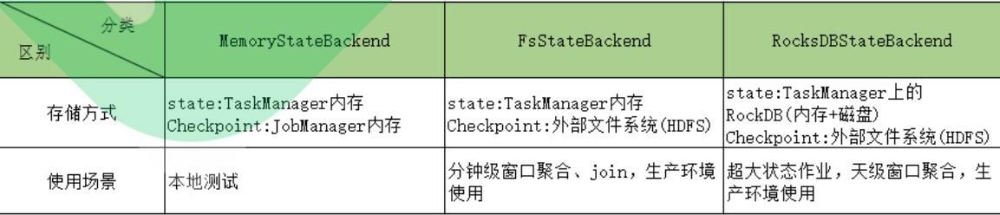
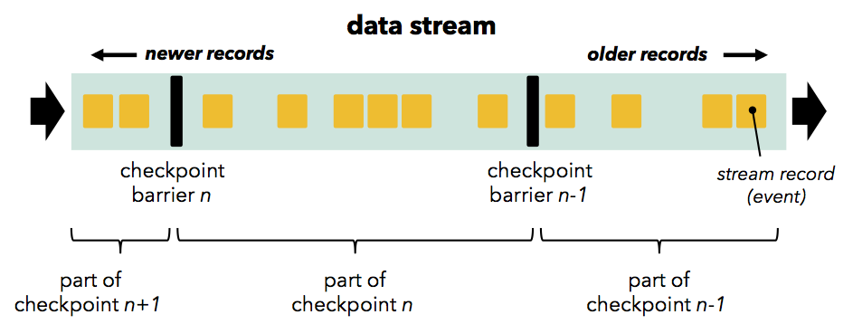
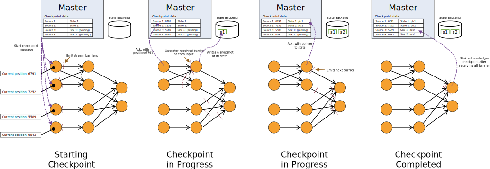

# State管理 和 Checkpoint容错机制

Flink 提供了 Exactly once 特性，是依赖于==带有 barrier 的分布式快照== + 可部分重发的数据源功能实现的。而分布式快照中，就保存了 operator 的状态信息。

Flink 的失败恢复依赖于 **检查点机制** + **可部分重发的数据源**。

+ **检查点机制**：checkpoint 定期触发，产生快照，快照中记录了：

  + 当前检查点开始时数据源（例如 Kafka）中消息的 offset。

  + 记录了所有有状态的 operator 当前的状态信息（例如 sum 中的数值）。

+ **可部分重发的数据源**：Flink 选择最近成功完成的检查点，然后系统重放整个分布式的数据流，然后给予每个 Operator 他们在该检查点快照中的状态。数据源被设置为从合适位置开始重新读取流。例如在 Apache Kafka 中，那意味着告诉消费者从偏移量 offset 开始重新消费。

举个例子解释 Flink Checkpoint 的作用：一个 Flink Job 就类似于一个 孩子，这个 job 在执行，就相当于这个孩子在长大，Flink job 进行周期性的snapshot，就类似于给孩子拍摄生日照片。如果父母忘记了孩子某次生日时候的模样，则可以拿出生日照片恢复记忆。

+ **state 就是 job 中的某一个 Task 在某个时刻的状态**

+ **checkpoint 就是 job 中的所有 Task 在某个时刻的状态**

+ 做一次checkpint 事实上就是把 这个 job 的所有 Task 的状态，全部持久化起来

+ 极大的问题：怎么做到消费数据的统一？ 上游Task: 10000, 下游Task:8000, 下一次恢复执行的时候，到底是从 8000 还是 从 10000 开始重放数据呢？

+ 从 8000 恢复重放，则上游 Task 会出现重复消费

+ 从 10000 开始重放，下游会出现没有消费 8000 - 10000 之间数据的情况，造成数据漏消费

+ 理想情况：上游 Task 执行到 10000，但是下游 执行到 8000，所以，我们必须从 8000 处拍摄快照， 总结：如果一条数据，被 sourceStrewmTask消费了，则一定要等到 下游 Task 也消费了，则 下游 Task 才跟着拍摄快照

所以如果一次成功的 checkpoint 都没有，则意味着，宕机之后的重启job 只能从 0 开始消费，如果有多次成功的 ceckpoint 记录，则从最近一次成功的checkpoint 中进行恢复！

checkpoint 实现核心：往数据流中插入 checkpint 标记：类似于 真实数据的一个 消息数据： CheckpointBarrier


## 1. State 状态管理原理剖析

Flink 的一个重要特性就是有状态计算：**Stateful Computations over Data Streams**

State 简单说，就是 Flink Job 的 Task 在运行过程中，产生的一些状态数据（StateLess）。这些状态数据，会辅助 Task 执行某些有状态计算，同时也涉及到 Flink Job 的重启状态恢复。所以，保存和管理每个 Task 的状态是非常重要的一种机制。这也是 Flink 有别于其他分布式计算引擎的最重要的区别。

State 需要配合检查点 Checkpoint 机制来保证 Flink 作业失败后能正确地进行错误恢复。这一节先讲 State 的管理。下一节知识点讲解 Flink Checkpoint。

Flink 中的状态分为两类，**Keyed State** 和 **Operator State** 。 

+ 1、Keyed State 是和具体的 Key 相绑定的，只能在 KeyedStream 上的函数和算子中使用。

+ 2、Opeartor State 则是和 Operator 的一个特定的并行实例相绑定的，例如 Kafka Connector 中，每一个并行的 Kafka Consumer 都在 OperatorState 中维护当前 Consumer 订阅的 partiton 和 offset。

由于 Flink 中的 keyBy 操作保证了每一个键相关联的所有消息都会送给下游算子的同一个并行实例处理，因此 Keyed State 也可以看作是 Operator State

的一种分区（partitioned）形式，每一个 key 都关联一个状态分区（state-partition）。

从另一个角度来看，无论 Operator State 还是 Keyed State，都有两种形式，**Managed State** 和 **Raw State**。 Managed State 的数据结构由 Flink 进

行托管，而 Raw State 的数据结构对 Flink 是透明的。 Flink 的建议是尽量使用 Managed State，这样 Flink 可以在并行度改变等情况下重新分布状态，

并且可以更好地进行内存管理。

**StateBackend** 定义了状态是如何存储的，不同的 State Backend 会采用不同的方式来存储状态，核心入口是： AbstractStateBackend，目前 Flink 提供了三种不同形式的存储后端，分别是 MemoryStateBackend, FsStateBackend 和 RocksDBStateBackend。

+ **MemoryStateBackend** 会将工作状态（Task State）存储在 TaskManager 的内存中，将检查点（Job State）存储在 JobManager 的内存中，速度很快，不支持持久化，通常用来存储一些 state 量小的情况下的 state。主要在开发调试中使用。

+ **FsStateBackend** 会将工作状态存储在 TaskManager 的内存中，将检查点存储在文件系统中（通常是分布式文件系统），用来存储 state 量比较大的，window 窗口很长的一些 job 的 state 比较合适。生产环境常用此方案。

+ **RocksDBStateBackend** 会把状态存储在 RocksDB 中，将检查点存储在文件系统中（类似 FsStateBackend），和 MemoryStateBackend 对比是速度快，GC 少，支持异步 Snapshot 持久化。用来存储 state 量比较大的，window 窗口很长的一些 job 的 state 比较合适。（Task的State存内存，Job的Checkpoint存RocksDB）

 

具体的一些源码细节，在看 StreamTask 执行过程中的一些细节，可看到！

Spark 支持把持久 RDD 存储： 普通的情况：内存 + 磁盘， 第三种情况：tachyon => alluxio（和 HDFS 是类似的，只不过是基于内存的）


## 2. Checkpoint 容错机制原理剖析

刚才说，State 是管理一个 Task 的状态，那么一个 Flink Job 在运行过程中，是由很多的 Task 分布式并行运行组成的。保管和管理一个 Task 的状态，对于一个 Task 的容错来说，非常重要，同样，保存和管理这个 Job 的所有 Task 的状态，并保持一致，也同样非常重要。这是 Flink 的 Job 容错的最终解决方案。

Flink 容错机制的核心是对数据流做连续的分布式快照(snapshots)，我们把每一次 take snapshot 动作称之为 Checkpoint。Checkpoint 是 Flink 实现容错机制最核心的功能，它能够根据配置周期性地基于 Stream 中各个 Operator/task 的状态来生成快照，从而将这些状态数据定期持久化存储下来，当Flink 程序一旦意外崩溃时，重新运行程序时可以有选择地从这些快照进行恢复，从而修正因为故障带来的程序数据异常。

> 具体的概念：Flink 的 checkpoint 机制基于 chandy-lamda 算法，在某一个时刻，对一个 Flink Job 的所有 Task 做一个快照拍摄，并且将快照保存在内存/磁盘 中永久保存，这样子，如果 Flink Job 重启恢复，就可以从故障前最近一次的成功快照中进行状态恢复，从而实现保证 Flink 数据流式数据的一致性。当然，为了配合 Flink 能实现状态快照，并且 job 状态恢复，必须数据源具备数据回放的功能。

简单地说，Checkpoint 是一种分布式快照：在某一时刻，对一个 Flink 作业所有的 task 做一个快照（snapshot），并且将快照保存在 memory / filesystem 等存储系统中。这样，在任务进行故障恢复的时候，就可以还原到任务故障前最近一次检查点的状态，从而保证数据的一致性。当然，为了保证exactly-once / at-least-once 的特性，还需要数据源支持数据回放。

实现 Checkpoint 的核心是：**Stream Barrier**，它和普通消息无异，Stream barrier 作为一种标记信息插入到数据流和正常数据一起流动。barriers 永远不会超过记录，数据流严格有序，barrier将数据流中的记录隔离成一系列的记录集合，并将一些集合中的数据加入到当前的快照中，而另一些数据加入到下一个快照中。每个 barrier 都带有快照的 ID，并且 barrier 之前的记录都进入了该快照。 barriers 不会中断流处理，非常轻量级。 来自不同快照的多个 barrier 可以同时在流中出现，这意味着多个快照可能并发地发生。

+ 正常数据： DataStream Buffer

+ 消息数据： DataStream Event（CheckpointBarrier,......)

Flink 的 Checkpoint Coordinator 在需要触发检查点的时候要求数据源向数据流中注入 Stream Barrier（具体实现：CheckpointBarrier（checkpointID, timestamp）），当执行 Task 的 Operator 从他所有的 InputChannel 中都收到了 Stream Barrier 则会触发当前的Operator 的快照拍摄，并向其下游 Operator 发送 Stream Barrier。当所有的 SinkOperator 都反馈完成了快照之后， Flink Checkpoint Coordinator认为 Checkpoint 创建成功。

为了帮助大家清楚的理解 Checkpoint 的工作机制，在此提供了三张图：

第一张图：

 

第二张图：

 

第三张图：

 

为什么要做对齐？

目的是为了 确保 一条数据如果被一个 Task 消费，那么就一定要被所有 Task 消费。否则如果一条数据 被 上游 Task 消费了，但是没有被下游 Task 消费，那么就会出现数据重复消费或者漏消费！


## 3. Checkpoint 容错机制核心 CheckpointCoordinator

Checkpoint 是 Flink Fault Tolerance 机制的重要构成部分，Flink checkpoint 的核心类名为org.apache.flink.runtime.checkpoint.CheckpointCoordinator

CheckpointCoordinator 是 Flink 的一个核心组件，位于 JobManager 进程，用于协调分布式快照和状态的触发与存储。CheckpointCoordinator 向相关算子(全部 source 算子)发送触发 checkpoint 的消息，并收集每个算子上报的快照完成的 ack 消息，这些 ack 消息包含算子进行快照后的状态句柄，

CheckpointCoordinator 则对这些状态句柄进行维护；待所有算子都上报 ack 消息后，CheckpointCoordinator 将这些元数据信息进行保存（根据选择的 StateBackend 保存在不同的位置）。

CheckpointCoordinator 的创建，StreamGraph 调用 enableCheckpointing() 方法的时候进行的。


### 3.1. Client 端生成 Checkpoint 配置

Flink 的应用程序，都是通过 StreamExecutionEnvironment 的 execute() 方法提交执行的。在 StreamExecutionEnvironment 初始化的时候，会调用：

```java
this.configure(this.configuration, this.userClassloader);
```

方法来执行配置参数的初始化，其中就会涉及到：

```java
checkpointCfg.configure(configuration);
```

代码的执行。

完成调用链：

```java
final StreamExecutionEnvironment env = StreamExecutionEnvironment.getExecutionEnvironment();
    getExecutionEnvironment(new Configuration());
        factory.createExecutionEnvironment(configuration)
            new StreamContextEnvironment(executorServiceLoader, mergedConfiguration, userCodeClassLoader, ....);
                super(executorServiceLoader, configuration, userCodeClassLoader);
                    this.configure(this.configuration, this.userClassloader);
                        // 方法来执行配置参数的初始化，其中就会涉及到:
                        checkpointCfg.configure(configuration);
```

这句代码中的相关参数的初始化，就是跟 Checkpoint 相关的各种参数。正常，我们在写 Flink 代码的时候，也都会设置一些 checkpoint 相关的参数。就

是在这儿进行解析的。

```java
StreamExecutionEnvironment env = StreamExecutionEnvironment.getExecutionEnvironment(); 

// 设置开启 checkpoint, 时间间隔为:1000ms
env.enableCheckpointing(1000);

// CheckpointingMode 默认是 CheckpointingMode.EXACTLY_ONCE，也可以指定为 CheckpointingMode.AT_LEAST_ONCE
env.getCheckpointConfig().setCheckpointingMode(CheckpointingMode.EXACTLY_ONCE); 

// 指定 checkpoint 执行的超时时间(单位 milliseconds)，超时没完成就会被 abort 掉
env.getCheckpointConfig().setCheckpointTimeout(60000);

// make sure 1000 ms of progress happen between checkpoints
env.getCheckpointConfig().setMinPauseBetweenCheckpoints(1000);

// 如果这个参数设置成1，就意味着，如果某个Task接收到了两个 checkpintID，直接丢弃小的，并且告诉 Coordiantor 取消小的这次 checkpint 
// allow only one checkpoint to be in progress at the same time 
env.getCheckpointConfig().setMaxConcurrentCheckpoints(1);

// enable externalized checkpoints which are retained after job cancellation
env.getCheckpointConfig().enableExternalizedCheckpoints(ExternalizedCheckpointCleanup.RETAIN_ON_CANCELLATION);

// This determines if a task will be failed if an error occurs in the execution of the task’s checkpoint procedure.
env.getCheckpointConfig().setFailOnCheckpointingErrors(true);
```

Flink-1.9 及之前版本只能使用 API 来进行 checkpoint 配置。Flink-1.10 可以在 conf/flink-conf.yaml 或通过 -yD/-D 方式配置。


### 3.2. 保存 Checkpoint 配置到 StreamGraph，JobGraph

在初始化 StreamExecutionEnvironment 的时候生成了 CheckpointConfig，被设置到 StreamGraphGenerator 中保存，然后在生成 StreamGraph 的时候，会设置到 StreamGraph 中。

```java
public void configure(ReadableConfig configuration, ClassLoader classLoader) {
    // 解析各种 checkpoint 配置
    checkpointCfg.configure(configuration);
}

private StreamGraphGenerator getStreamGraphGenerator() {
    // 设置到 StreamGraphGenerator 中
    return new StreamGraphGenerator(transformations, config, checkpointCfg, getConfiguration())
                .setRuntimeExecutionMode(executionMode)
                .setStateBackend(defaultStateBackend)
                .setChaining(isChainingEnabled)
                .setUserArtifacts(cacheFile)
                .setTimeCharacteristic(timeCharacteristic)
                .setDefaultBufferTimeout(bufferTimeout);
}
```

StreamGraphGenerator 调用 generate() 解析应用程序计算代码生成 StreamGraph 的时候，把 CheckpointCfg 设置到 StreamGraph 中

```java
StreamJobGraphGenerator.generate() {
    streamGraph = new StreamGraph(executionConfig, checkpointConfig, savepointRestoreSettings);
}
```

然后在由 StreamingJobGraphGenerator 解析 StreamGraph 生成 JobGraph 的时候，由：

```java
// 入口，从 StreamGraph 解析生成 JobGraph 的时候，将 Checkpointconfig 设置到 JobGraph 中 
StreamingJobGraphGenerator.createJobGraph();

    // 给 JobGraph 设置 Checkpointconfig 
    StreamingJobGraphGenerator.configureCheckpointing();

        // 从 StreamGraph 获取到 CheckPointConfig
        CheckpointConfig cfg = streamGraph.getCheckpointConfig();

        // 创建 JobCheckpointingSettings 对象
        JobCheckpointingSettings settings = new JobCheckpointingSettings(triggerVertices, ackVertices, commitVertices, ...);

        // 存储在 JobGraph 中 
        jobGraph.setSnapshotSettings(settings);
```

将 CheckpointConfig 中的各种参数，封装成 JobCheckpointingSettings 对象，然后设置到 JobGraph 中由成员变量 snapshotSettings 来进行保存。

```java
/** The settings for the job checkpoints */
private JobCheckpointingSettings snapshotSettings;
```

StreamGraph 转换成 JobGraph 时，定义了三种顶点，请注意：

+ triggerVertices：需要 “触发 checkpoint” 的顶点，后续 CheckpointCoordinator 发起 checkpoint 时，只有这些点会收到 trigger checkpoint 消息。只有 source 顶点会成为 triggerVertices

+ ackVertices：需要在 snapshot 完成后，向 CheckpointCoordinator 发送 ack 消息的顶点。所有顶点都是 ackVertices

+ commitVertices：需要在 checkpoint 完成后，收到 CheckpointCoordinator 的 notifyCheckpointComplete 消息的顶点。所有顶点都是commitVertices


### 3.3. 保存 Checkpoint 配置到 ExecutionGraph

然后客户端会提交 JobGraph 到 JobManager 中，JobManager 启动了 JobMaster 之后，会将 JobGraph 转变成 ExecutionGraph，具体实现由下面方法完成。

```java
ExecutionGraphBuilder.buildGraph(JobGraph jobGraph);
```

核心逻辑为：

```java
ExecutionGraphBuilder.buildGraph(JobGraph jobGraph); 

    // 获取 JobGraph 中的 JobCheckpointingSettings
    JobCheckpointingSettings snapshotSettings = jobGraph.getCheckpointingSettings();

    // 获取 triggerVertices，ackVertices，confirmVertices
    List<ExecutionJobVertex> triggerVertices = idToVertex(snapshotSettings.getVerticesToTrigger(), executionGraph); 
    List<ExecutionJobVertex> ackVertices = idToVertex(snapshotSettings.getVerticesToAcknowledge(), executionGraph); 
    List<ExecutionJobVertex> confirmVertices = idToVertex(snapshotSettings.getVerticesToConfirm(), executionGraph);

    // 创建 CompletedCheckpointStore
    CompletedCheckpointStore completedCheckpoints = recoveryFactory.createCheckpointStore(jobId, ....);

    // 创建 CheckpointIDCounter
    CheckpointIDCounter checkpointIdCounter = recoveryFactory.createCheckpointIDCounter(jobId);

    // 创建 CheckpointStatsTracker checkpoint 状态追踪器
    CheckpointStatsTracker checkpointStatsTracker = new CheckpointStatsTracker(....);

    // 获取 CheckpointCoordinatorConfiguration
    final CheckpointCoordinatorConfiguration chkConfig = snapshotSettings.getCheckpointCoordinatorConfiguration();

    // 从 ExeuctionGraph 中启用 Checkpoint
    executionGraph.enableCheckpointing(chkConfig, triggerVertices, ackVertices, confirmVertices, ....);

        // 先解析 ExecutionVertex
        ExecutionVertex[] tasksToTrigger = collectExecutionVertices(verticesToTrigger); 
        ExecutionVertex[] tasksToWaitFor = collectExecutionVertices(verticesToWaitFor); 
        ExecutionVertex[] tasksToCommitTo = collectExecutionVertices(verticesToCommitTo);

        // 再生成一个 CheckpointFailureManager 用来处理 checkpoint 失败的情况 
        CheckpointFailureManager failureManager = new CheckpointFailureManager(...);

        // 创建一个定时调度器
        ScheduledExecutorService checkpointCoordinatorTimer = Executors.newSingleThreadScheduledExecutor(
            new DispatcherThreadFactory(Thread.currentThread().getThreadGroup(), "Checkpoint Timer")
        );

        // 创建 CheckpointCoordinator
        checkpointCoordinator = new CheckpointCoordinator(....);

        // 设置 checkpoint 状态监听器:CheckpointStatsTracker 
        checkpointCoordinator.setCheckpointStatsTracker(checkpointStatsTracker);

        // 注册 Job 状态监听器，如果 Job 的状态更新成 Running 的话，则 Checkpoint 定时器启动 
        registerJobStatusListener(checkpointCoordinator.createActivatorDeactivator());
            jobStatusListener = new CheckpointCoordinatorDeActivator(this);
                if(newJobStatus == JobStatus.RUNNING) {
                    // start the checkpoint scheduler
                    coordinator.startCheckpointScheduler();
                }
```

checkpointCoordinator.createActivatorDeactivator() 方法返回的是一个 JobStatusListener，具体实现是：CheckpointCoordinatorDeActivator，它的作用是：当监听到 Job 的状态为 JobStatus.RUNNING 的时候，就开始执行 CheckpointCoordinatorDeActivator.jobStatusChanges() 的回调处理，通过CheckpointCoordinator 的 startCheckpointScheduler() 启动 checkpoint 的定时器。而具体的间隔时间，一般都由用户自己设置。

在 ExecutionGraphBuilder 解析 JobGraph 生成 ExectionGraph 的时候，总结一下，大概做了以下这么几件事：

```
1、解析 ExecutionGraph 中的各种 ExecutionVertex，设置到 tasksToTrigger，tasksToWaitFor，tasksToCommitTo 数组中 
2、创建 CheckpointFailureManager，管理 checkpoint 失败后的策略 
3、创建定时器 checkpointCoordinatorTimer（ScheduledExecutorService），用于定时触发 checkpoint 
4、注册了 CheckpointStatsTracker 组件，用来汇总 Checkpoint 的统计信息。 
5、创建 CheckpointCoordinator，并注册 CheckpointCoordinatorDeActivator, 监听 JobStatus，当变成 RUNNING 的时候，开启 Checkpoint 定时任务
```


### 3.4. ExecutionGraph 启动 CheckpointCoordinator

CheckpointCoordinator 是 Flink 分布式快照流程的协调者， 它主要负责：

```java
1、发起 checkpoint 触发的消息，并接收不同 task 对 checkpoint 的响应信息（ack） 

2、维护 Ack 中附带的状态句柄（state-handle）的全局视图
```

在 ExecutionGraphBuilder 的 buildGraph() 方法中，如果作业开启了 checkpoint，则会调用 ExecutionGraph.enableCheckpointing() 方法, 这里会创建 CheckpointCoordinator 对象，并注册一个作业状态的监听 CheckpointCoordinatorDeActivator, CheckpointCoordinatorDeActivator 会在作业状态发生改变时得到通知，然后回调：jobStatusChanges() 方法

```java
public void jobStatusChanges(JobID jobId, JobStatus newJobStatus, long timestamp, Throwable error) { 
    // 如果 JobStatus = JobStatus.RUNNING 
    if(newJobStatus == JobStatus.RUNNING) { 
    /	/ 开启 checkpoint 定时调度 
    coordinator.startCheckpointScheduler(); 
    } else { 
    	coordinator.stopCheckpointScheduler(); 
    } 
}
```

CheckpointCoordinator 的作用：CheckpointCoordinator 是 Flink 执行 Checkpoint 的核心组件，JobManager 在接收到 Client 端的 SubmitJob 请求后将 JobGraph 转化为 ExecutionGraph，并调用 enableCheckpointing 方法初始化 CheckpointCoordinator，然后为 CheckpointCoordinator 注册一个Job 状态变化的监听器 CheckpointCoordinatorDeActivator。CheckpointCoordinatorDeActivator 实现了 JobStatusListener 接口，当 job 状态变成Running 时，调用startCheckpointScheduler 方法开启 CheckpointScheduler，当 job 变成其他状态时，调用 stopCheckpointScheduler 方法停止CheckpointScheduler。

在关注具体调度的时候，请首先看，回调机制是怎么实现的：当 JobMaster 的 start() 启动 JobMaster 的时候：

```java
JobMaster.start();
    JobMaster.startJobExecution(newJobMasterId);
        resetAndStartScheduler();
            startScheduling();
                schedulerNG.startScheduling();
                    startSchedulingInternal();
                        prepareExecutionGraphForNgScheduling();
                            executionGraph.transitionToRunning();
                                // 把 JobStatus 从 CREATED 改成 RUNNING 
                                transitionState(JobStatus.CREATED, JobStatus.RUNNING);
                                    transitionState(current, newState, null);
                                        notifyJobStatusChange(newState, error);
                                            // 实现回调 监听器的 jobStatusChanges 方法 
                                            listener.jobStatusChanges(getJobID(), newState, timestamp, serializedError);
```

然后再研究 coordinator.startCheckpointScheduler() 的内部实现：

```java
coordinator.startCheckpointScheduler(); 
    // 先停掉之前的 checkpoint 调度 
    stopCheckpointScheduler();
    // 标记当前为 定时调度 
    periodicScheduling = true;
    // 开始调度:内部具体通过 scheduleTriggerWithDelay(getRandomInitDelay()) 来实现调度 
    currentPeriodicTrigger = scheduleTriggerWithDelay(getRandomInitDelay());
        // getRandomInitDelay() 内部在 最小间隔时间 和 checkpoint 间隔时间 + 1 中产生一个随机值
        ThreadLocalRandom.current().nextLong(minPauseBetweenCheckpoints, baseInterval + 1L);
        // scheduleTriggerWithDelay 开始调度
        timer.scheduleAtFixedRate(new ScheduledTrigger(), initDelay, baseInterval, TimeUnit.MILLISECONDS);
```

其中：getRandomInitDelay() 存在意义是让 ：ScheduledExecutor timer 不要一上来就执行 checkpoint，而是等一段随机时间（在minPauseBetweenCheckpoints 和 baseInterval + 1L 之间）。ScheduledTrigger 就是定时调度的一个 checkpoint 触发器。

具体的 minPauseBetweenCheckpoints 和 baseInterval 是多少，就看用户的设置是多少：

```java
StreamExecutionEnvironment env = StreamExecutionEnvironment.getExecutionEnvironment(); 

// 设置：baseInterval = 10s, 默认 500 = 0.5s 
env.enableCheckpointing(10000); 

// 设置：minPauseBetweenCheckpoints = 1s， 默认 0 
env.getCheckpointConfig().setMinPauseBetweenCheckpoints(1000); 
```

当触发调度的时候，就会跳转到：ScheduledTrigger.run() 方法。从此开始一次 checkpoint 的旅程！


### 3.5. CheckpointCoordinator 发送 checkpoint 请求给 SourceStreamTask

所以，从上可知，真正开始执行 checkpoint 的入口是：

```java
CheckpointCoordinator.triggerCheckpoint(true);
```

接下来看调度逻辑：

```java
// checkpoint 核心入口 
CheckpointCoordinator.startCheckpointScheduler();

    CheckpointCoordinator.scheduleTriggerWithDelay(getRandomInitDelay()); 

        // 定时调度任务
        timer.scheduleAtFixedRate(new ScheduledTrigger(), initDelay, baseInterval, TimeUnit.MILLISECONDS);

            ScheduledTrigger.run();

                // 任务定时，其实就是定时调用 CheckpointCoordinator 的 triggerCheckpoint() 方法触发 checkpoint 
                CheckpointCoordinator.triggerCheckpoint(true);

                    CheckpointCoordinator.triggerCheckpoint(checkpointProperties, null, isPeriodic, false); 

                        // 生成一个 CheckpointTriggerRequest
                        CheckpointTriggerRequest request = new CheckpointTriggerRequest(...);

                        CheckpointCoordinator.startTriggeringCheckpoint(CheckpointTriggerRequest);

                            // checkpoint 初始化:创建 checkpointID 和 CheckpointStorageLocation
                            CheckpointCoordinator.initializeCheckpoint(...);
                                long checkpointID = checkpointIdCounter.getAndIncrement();
                                checkpointStorageLocation = checkpointStorage.initializeLocationForCheckpoint(checkpointID);

                                return new CheckpointIdAndStorageLocation(checkpointID, checkpointStorageLocation); 

                        // 创建 PendingCheckpoint，如果 checkpoint 完成，则会变成: CompletedCheckpoint
                        CheckpointCoordinator.createPendingCheckpoint(....); 
    
                            // 生成一个 PendingCheckpoint 并注册
                            final PendingCheckpoint checkpoint = new PendingCheckpoint(job, checkpointID, timestamp, ...)
                                
                            pendingCheckpoints.put(checkpointID, checkpoint);
                            // 调度一个 checkpoint 超时取消的任务
                            timer.schedule(new CheckpointCanceller(checkpoint), checkpointTimeout, TimeUnit.MILLISECONDS);

                        // 开始执行 checkpoint 
                        CheckpointCoordinator.snapshotTaskState();
                            // 遍历每一个 Source ExecutionVertex, 触发 checkpoint 
                            for(Execution execution : executions) {
                                if(props.isSynchronous()) {
                                    // 处理同步的 savepoint
                                    execution.triggerSynchronousSavepoint(checkpointID, ....);
                                } else {
                                    // Flink checkpoint 为了保证数据消费的一致性，不停的往 datastrewam 嵌入了 CheckpointBarrier
                                    // 这个 CheckpointBarrier 中的最重要的信息就是 checkpointID, timestamp 
                                    execution.triggerCheckpoint(checkpointID, timestamp, checkpointOptions);
                                        Execution.triggerCheckpoi ntHelper(checkpointId, timestamp, ...., false);
                                            TaskManagerGateway taskManagerGateway = slot.getTaskManagerGateway();
                                            taskManagerGateway.triggerCheckpoint(.....);
                                                // 发送 Checkpoint RPC 给对应的 Source ExecutionVertex 组件 
                                                taskExecutorGateway.triggerCheckpoint(....);
                                }
                            }

                        // 完成 checkpoint 的 ack 处理 
                        maybeCompleteCheckpoint(checkpoint);

                        // 触发 chekpoint 成功回调，调度下一次 checkpoint 请求执行
                        onTriggerSuccess();
```

到此为止，JobMaster 终于把 Checkpoint 请求发送给了对应执行了 Source ExecutioinVertex 的 TaskManager 节点了。

在这个过程中，可能会取消 Checkpoint，如果满足如下的条件：

```
1、coordinator 处于 shutdown 状态 
2、周期性 checkpoint 调度被取消 (periodicScheduling=false)，一般 periodicScheduling=false 时，是因为用户手动触发了 savepoint 
3、当前有排队的 checkpoint 请求 
4、当前 pendingCheckpoints 数量达到设定的上限 
5、与上一次 checkpoint 间隔小于设定的最小值，如果间隔太小，会取消并重新设定调度器 
6、如果 job 的所有 Srouce ExecutionVertex 没有全处于 RUNNING 的状态的时候 
```


#### 3.5.1. checkpoint 失败回调

如果 checkpoint 失败，则会回调 onTriggerFailure(request, throwable); 请看详细逻辑：

```java
onTriggerFailure(request, throwable);
    onTriggerFailure((PendingCheckpoint) null, checkpointException);
        // 取消当前正在进行的 checkpoint 
        coordinatorsToCheckpoint.forEach(OperatorCoordinatorCheckpointContext::abortCurrentTriggering); 
        // 取消 PendingCheckpoint
        abortPendingCheckpoint(checkpoint, cause);
        // 执行队列中的 checkpoint 请求
        executeQueuedRequest();
```

#### 3.5.2. checkpoint 成功回调

如果 checkpoint 成功，则会回调 onTriggerSuccess(); 请看详细逻辑：

```java
onTriggerSuccess();
    // 开始下一个 checkpoint 请求 
    executeQueuedRequest();
        // 从队列中调度下一次可执行的 ckp 最优的调度请求
        chooseQueuedRequestToExecute().ifPresent(this::startTriggeringCheckpoint);
```


### 3.6. SourceStreamTask 的 TaskManager 处理 Checkpoint 请求

当 TaskManager 接收到 checkpoint 请求的时候，内部调用 Task 的 checkpoint 处理方法： triggerCheckpointBarrier

```java
// TaskManager 收到 JobMaster 的 CheckpointCoordinator 发送过来的 Checkpoint 请求 
TaskExecutor.triggerCheckpoint(ExecutionAttemptID executionAttemptID, long checkpointId,....);

    // 调用 Task 的 checkpoint 处理方法
    Task.triggerCheckpointBarrier(checkpointId, checkpointTimestamp, checkpointOptions, advanceToEndOfEventTime);

        // 获取 Task 的 AbstractInvokable 
        AbstractInvokable invokable = this.invokable;

        // 生成 Checkpoint 元数据:CheckpointMetaData
        CheckpointMetaData checkpointMetaData = new CheckpointMetaData(checkpointID, checkpointTimestamp);

        // 执行 SourceStreamTask 的状态判断，看是继续 checkpoint 还是取消 
        if(executionState == ExecutionState.RUNNING && invokable != null) {
            // 触发 Checkpoint
            invokable.triggerCheckpointAsync(checkpointMetaData, checkpointOptions, advanceToEndOfEventTime);
        } else {
            // 如果 Task 不是 Running 状态，或者 invokable 为空，则拒绝执行 Checkpoint
            checkpointResponder.declineCheckpoint(jobId, executionId, checkpointID, new CheckpointException(....);
        }
```

**注意：只有 SourceStreamTask 才会收到 JobMaster 中的 CheckpointCoordinator 的 triggerCheckpoint RPC 请求。**

经过一些跳转，最终跳转到：StreamTask

```java
StreamTask.triggerCheckpointAsync(checkpointMetaData, checkpointOptions, advanceToEndOfEventTime);
```

内部通过 MailBox 模型来调度执行，内部调用：

```java
triggerCheckpoint(checkpointMetaData, checkpointOptions, advanceToEndOfEventTime)
```

来触发执行 checkpoint。从这里开始，就进入到 MailBox 的主线程来进行 checkpoint 了。

在该方法中，核心逻辑为：

```java
// 1、执行 SubtaskCheckpointCoordinatorImpl 的初始化 
subtaskCheckpointCoordinator.initCheckpoint(checkpointMetaData.getCheckpointId(), checkpointOptions);

// 2、执行 checkpoint
boolean success = performCheckpoint(checkpointMetaData, checkpointOptions, checkpointMetrics, advanceToEndOfEventTime);
    subtaskCheckpointCoordinator.checkpointState(.....)
        
// 3、通过上述的返回值来判断是否要取消 checkpoint 
if(!success) {
    declineCheckpoint(checkpointMetaData.getCheckpointId());
}
```


### 3.7. StreamTask.performCheckpoint() 完成逻辑处理

说道最后，performCheckpoint 才是重点！在 performCheckpoint() 方法中，会调用：SubtaskCheckpointCoordinatorImpl 的 checkpointState() 执行

state 的快照！内部分为这么几个步骤：

```java
// Step (0): Record the last triggered checkpointId and abort the sync phase of checkpoint if necessary. 
// 记录最后触发的checkpointId，并在必要时中止 checkpoint 的同步阶段。
lastCheckpointId = metadata.getCheckpointId(); 
if(checkAndClearAbortedStatus(metadata.getCheckpointId())) {
    // broadcast cancel checkpoint marker to avoid downstream back-pressure due to checkpoint barrier align.
    // 广播 CancelCheckpointMarker 以避免由于 barrier 对齐导致的下游背压
    operatorChain.broadcastEvent(new CancelCheckpointMarker(metadata.getCheckpointId()));
    return; 
}

// Step (1): Prepare the checkpoint, allow operators to do some pre-barrier work. The pre-barrier work should be nothing or minimal in the common case.
// 准备检查点，允许操作员进行一些 pre-barrier 工作。在一般情况下，pre-barrier 工作应该什么都不做或尽量少做。 
operatorChain.prepareSnapshotPreBarrier(metadata.getCheckpointId());

// Step (2): Send the checkpoint barrier downstream
// 将检查点屏障发送到下游
operatorChain.broadcastEvent(new CheckpointBarrier(metadata.getCheckpointId(), metadata.getTimestamp(), options), options.isUnalignedCheckpoint());

// Step (3): Prepare to spill the in-flight buffers for input and output 
// 准备溢出 in-flight buffers 以用于输入和输出 
if(options.isUnalignedCheckpoint()) {
    // output data already written while broadcasting event
    channelStateWriter.finishOutput(metadata.getCheckpointId());
}

// Step (4): Take the state snapshot. This should be largely asynchronous, to not impact progress of the streaming topology
// 拍摄状态快照。这在很大程度上应该是异步的，不影响流拓扑的进度
if(takeSnapshotSync(snapshotFutures, metadata, metrics, options, operatorChain, isCanceled)) {
    // 发送 ack
    finishAndReportAsync(snapshotFutures, metadata, metrics, options);
}
```

事实上一个 Job 的所有 Task 的 state 的 checkpoint 是由 takeSnapshotSync 来真正完成的。最底层会调用 StreamOperatorStateHandler 的snapshotState() 方法来完成具体的工作，它的内部主要做三件事：

```java
// 1、对 StreamOperator 完成 snapshot 
streamOperator.snapshotState(snapshotContext);

// 2、针对 Operator 类型的状态执行 snapshot 
operatorStateBackend.snapshot(checkpointId, timestamp, factory, checkpointOptions)
    
// 3、针对 KeyedState 类型的状态执行 snapshot 
keyedStateBackend.snapshot(checkpointId, timestamp, factory, checkpointOptions)
```


### 3.8. 非 SourceStreamTask 的 Barrier 消息处理

核心入口： StreamTask.processInput();

```java
// StreamTask 在启动的时候，就会调用 processInput 来处理输入 
StreamTask.processInput();
    inputProcessor.processInput();
        InputStatus status = input.emitNext(output);
            // 进入 StreamTaskNetworkInput 拉取数据
            Optional<BufferOrEvent> bufferOrEvent = checkpointedInputGate.pollNext();
                // 拉取消息，有可能是 CheckpointBarrier 
                Optional<BufferOrEvent> next = inputGate.pollNext(); 
                BufferOrEvent bufferOrEvent = next.get();
                // 正常数据
                if(bufferOrEvent.isEvent()) 
                    return handleEvent(bufferOrEvent);
                
                    // CheckpointBarrier 消息
                    if(eventClass == CheckpointBarrier.class) {
                        CheckpointBarrier checkpointBarrier = (CheckpointBarrier) bufferOrEvent.getEvent();
                        barrierHandler.processBarrier(checkpointBarrier, bufferOrEvent.getChannelInfo());
                    }
                    // 其他消息

```

正常来说，拉取到的消息 BufferOrEvent 应该都是 待计算的数据，少数是 CheckpointBarrier，如果是接收到 CheckpointBarrier，则需要按照规定来是否执行对齐操作，总之由 barrierHandler.processBarrier(...) 方法执行处理。

重点关注：

```java
// StreamTask 处理 CheckpointBarrier 消息 
CheckpointBarrierHandler.processBarrier(checkpointBarrier, bufferOrEvent.getChannelInfo());
    // 如果 InputChannel 总共只有 1 个，直接进行 checkpoint 
    notifyCheckpoint(receivedBarrier, latestAlignmentDurationNanos);

    // 如果 InputChannel 不是 1 个，并且还是处于 Pending 状态 
    // 如果 barrierId == currentCheckpointId 
    onBarrier(channelInfo);

    // 如果 barrierId > currentCheckpointId
    notifyAbort(currentCheckpointId, new CheckpointException(....)); 
    beginNewAlignment(barrierId, channelInfo, receivedBarrier.getTimestamp());

    // 如果 else 
    resumeConsumption(channelInfo);

    // 如果 barrierId > currentCheckpointId
    beginNewAlignment(barrierId, channelInfo, receivedBarrier.getTimestamp());

    // 如果 对齐了所有的 InputChannel
    if(numBarriersReceived + numClosedChannels == totalNumberOfInputChannels) {
        notifyCheckpoint(receivedBarrier, latestAlignmentDurationNanos);
    }
```

总结：

```java
1、InputChannel 的个数 == 1
    notifyCheckpoint(receivedBarrier, latestAlignmentDurationNanos);

2、InputChannel 的个数 != 1
    // currentCheckpointId 处于待定状态 
    1、isCheckpointPending() == True
        1、barrierId == currentCheckpointId 
            // 阻塞
            onBarrier(channelInfo); 
        2、barrierId > currentCheckpointId
            // 取消上一次 checkpint
            notifyAbort(currentCheckpointId, .....) 
        3、barrierId < currentCheckpointId
            // 继续消费
            resumeConsumption(channelInfo);
    2、barrierId > currentCheckpointId & !isCheckpointPending()
        // 执行新对齐
        beginNewAlignment(barrierId, channelInfo, receivedBarrier.getTimestamp()); 
    3、else
        // 继续消费 
        resumeConsumption(channelInfo);

    // 最后的逻辑: 当前这个StreamTask 的这一次checkpoint的所有的 CheckpointBarrier 已经全部接收到了意味着对齐了 
    if(numBarriersReceived + numClosedChannels == totalNumberOfInputChannels) {
        // 执行 checkpoint
        notifyCheckpoint(receivedBarrier, latestAlignmentDurationNanos);
    }
```

如果，所有 InputChannel 都接收到了当前这次 checkpoint 对应的 CheckpointBarrier，则意味着对齐完成，则做两件事：

```java
1. 继续消费：resumeConsumption(blockedChannel.getKey());
2. 执行 checkpoint：notifyCheckpoint(receivedBarrier, latestAlignmentDurationNanos);
```

其中：

```java
// 执行 checkpoint
CheckpointBarrierHandler.notifyCheckpoint(receivedBarrier, latestAlignmentDurationNanos);

// 调用 AbstractInvokable 的 triggerCheckpointOnBarrier 方法执行 checkpoint
// 注意:此处的 AbstractInvokable 就是 StreamTask
AbstractInvokable.triggerCheckpointOnBarrier (checkpointMetaData, checkpointBarrier.getCheckpointOptions(), checkpointMetrics);
```

内部依然调用 StreamTask.performCheckpoint(....) 来完成实际的 Task State 的 Checkpoint 处理。


### 3.9. CheckpointCoordinator 处理反馈

当这个 TaskExecutor 中的某个 Task 成完了一次 checkpoint 处理，最后会调用 finishAndReportAsync(....) 提交一个异步 checkpoint 任务：AsyncCheckpointRunnable。在该任务执行的时候，先 持久化 state，然后给 JobMaster 中的 CheckpointCoordiantor 发送反馈消息。核心实现：

```java
SubtaskCheckpointCoordinatorImpl.finishAndReportAsync(snapshotFutures, metadata, metrics, options); 
	executorService.execute(new AsyncCheckpointRunnable(....));
```

然后跳转到 AsyncCheckpointRunnable 的 run() 方法，内部实现：

```java
SubtaskCheckpointCoordinatorImpl.finishAndReportAsync(snapshotFutures, metadata, metrics, options);
    executorService.execute(new AsyncCheckpointRunnable(....));

        AsyncCheckpointRunnable.run(); 
            // 保存 state
            jobManagerTaskOperatorSubtaskStates.putSubtaskStateByOperatorID(operatorID, finalizedSnapshots.getJobManagerOwnedState());

        localTaskOperatorSubtaskStates.putSubtaskStateByOperatorID(operatorID, finalizedSnapshots.getTaskLocalState()); 
        // 汇报状态
        reportCompletedSnapshotStates(jobManagerTaskOperatorSubtaskStates, localTaskOperatorSubtaskStates, asyncDurationMillis);

            // 内部通过:TaskStateManager 来进行反馈 
            taskEnvironment.getTaskStateManager().reportTaskStateSnapshots(....);
                // 最终调用的是: CheckpointResponder 来实现 
                checkpointResponder.acknowledgeCheckpoint(jobId, executionAttemptID, checkpointId, ....);
                    // 发送 RPC 请求给 CheckpointCoordinator，其实这个 checkpointCoordinatorGateway 就是 JobMaster 
                    checkpointCoordinatorGateway.acknowledgeCheckpoint(jobID, executionAttemptID, checkpointId, ....);
```

所以，由上可知：Task 对 checkpoint 的响应是通过 CheckpointResponder 接口完成的：

```java
public interface CheckpointResponder {
    // 接收反馈
    void acknowledgeCheckpoint(JobID jobID, ExecutionAttemptID executionAttemptID, long checkpointId, CheckpointMetrics checkpointMetrics, TaskStateSnapshot subtaskState);

    // 取消 checkpoint
    void declineCheckpoint(JobID jobID, ExecutionAttemptID executionAttemptID, long checkpointId, Throwable cause);
}
```

RpcCheckpointResponder 作为 CheckpointResponder 的具体实现，主要是通过 RPC 调用通知CheckpointCoordinatorGateway，即通知给JobMaster, JobMaster 调用CheckpointCoordinator.receiveAcknowledgeMessage() 和CheckpointCoordinator.receiveDeclineMessage() 进行处理。

然后当 TaskExecutor 执行完 checkpoint 之后，发送回反馈，CheckCoordinator 执行处理。核心入口是：JobMaster.acknowledgeCheckpoint() 方法下面看详细流程：

```java
// JobMaster 收到 TaskExecutor 中的 TaskStateManager 发送回来的反馈 
JobMaster.acknowledgeCheckpoint();
    // 执行反馈处理 
    SchedulerBase.acknowledgeCheckpoint();
        // CheckpointCoordinator 执行反馈处理 
        CheckpointCoordinator.receiveAcknowledgeMessage();

            // 处理 Task 节点返回的 ack 信息 
            PendingCheckpoint.acknowledgeTask();
            // 判断该 PendingCheckpoint 该发的和该收到的 ack 是否都已经成功 ack 
            if(checkpoint.isFullyAcknowledged()) {
                // 更改 PendingCheckpoint 为 CompletedCheckpoint
                CheckpointCoordinator.completePendingCheckpoint(checkpoint);
            }
```

在一个 Task 完成 checkpoint 操作后，CheckpointCoordinator 接收到 Ack 响应，对 Ack 响应的处理流程主要如下：

+ 根据 Ack 的 checkpointID 从 Map<Long, PendingCheckpoint> pendingCheckpoints 中查找对应的 PendingCheckpoint

+ 若存在对应的 PendingCheckpoint（对于一个已经触发但还没有完成的checkpoint，即PendingCheckpoint）

  + 这个 PendingCheckpoint 没有被丢弃，调用 PendingCheckpoint.acknowledgeTask 方法处理 Ack，根据处理结果的不同：

    + SUCCESS：判断是否已经接受了所有需要响应的 Ack，如果是，则调用 completePendingCheckpoint 完成此次 checkpoint

    + DUPLICATE：Ack 消息重复接收，直接忽略
    + UNKNOWN：未知的 Ack 消息，清理上报的 Ack 中携带的状态句柄
    + DISCARD：Checkpoint 已经被 discard，清理上报的 Ack 中携带的状态句柄

  + 这个 PendingCheckpoint 已经被丢弃，抛出异常

+ 若不存在对应的 PendingCheckpoint，则清理上报的 Ack 中携带的状态句柄

其他的细节，请看源码项目的注释！


### 3.10. CheckpointCoordinator 完成 Checkpoint 处理

核心方法入口：

```java
// 完成 Checkpoint 
CheckpointCoordinator.maybeCompleteCheckpoint(PendingCheckpoint checkpoint);
    // 完成 checkpoint 
    completePendingCheckpoint(checkpoint);

        // 将 PendingCheckpoint 转化为 CompletedCheckpoint
        completedCheckpoint = pendingCheckpoint.finalizeCheckpoint();
        // 将 CompletedCheckpoint 保存到 CompletedCheckpointStore 中 
        completedCheckpointStore.addCheckpoint(completedCheckpoint);
        // 将完成的 PendingCheckpoint 移除掉 
        pendingCheckpoints.remove(checkpointId);
        // 调度下一次 checkpoint
        timer.execute(this::executeQueuedRequest);
        // 记住当前这次成功的 checkpoint ID
        rememberRecentCheckpointId(checkpointId);
        // 丢弃先启动的，但是未成功的 checkpoint 
        dropSubsumedCheckpoints(checkpointId);
        // 发送 checkpoint 成功的消息给所有的 Task 
        sendAcknowledgeMessages(checkpointId, completedCheckpoint.getTimestamp());
            // 给每一个 Task 发送 checkpoint Complete 的消息 
            Execution.notifyCheckpointComplete(checkpointId, timestamp);
                // 通过 RPC 给 TaskManager 发送 Task Checkpoint 成功消息 
                taskManagerGateway.notifyCheckpointComplete(attemptId, getVertex().getJobId(), checkpointId, timestamp);
                    taskExecutorGateway.confirmCheckpoint(executionAttemptID, checkpointId, timestamp); 
                        // Task 确认 Checkpoint 成功
                        final Task task = taskSlotTable.getTask(executionAttemptID); 
                        task.notifyCheckpointComplete(checkpointId);
                            invokable.notifyCheckpointCompleteAsync(checkpointID);
                                StreamTask.notifyCheckpointComplete(checkpointId);
```

其实一个 StreamTask 去确认该 checkpointID 的 checkpoint 成功，是通过：SubtaskCheckpointCoordinator 来完成的，所以：

```java
StreamTask.notifyCheckpointComplete(checkpointId);
    // StreamTask 内部通过 SubtaskCheckpointCoordinator 来完成 checkpoint 成功确认 
    SubtaskCheckpointCoordinator.notifyCheckpointComplete(checkpointId, operatorChain, this::isRunning);

        // StreamTask 内部的所有 StreamOperator 都需要确认 
        StreamOperatorWrapper.notifyCheckpointComplete(checkpointId);
            wrapped.notifyCheckpointComplete(checkpointId);
                // 这里重点关注:FlinkKafkaConsumerBase
                ((CheckpointListener) userFunction).notifyCheckpointComplete(checkpointId);
                    // 提交 offset 保存
                    fetcher.commitInternalOffsetsToKafka(offsets, offsetCommitCallback);
                        // 提交消费进度到 kafka 
                        doCommitInternalOffsetsToKafka(filterOutSentinels(offsets), commitCallback);
                            // 提交 offset 保存
                            consumerThread.setOffsetsToCommit(offsetsToCommit, commitCallback); 
        // 通知 TaskStateManager
        env.getTaskStateManager().notifyCheckpointComplete(checkpointId); 
            // Flink-1.5 版本提供的一种优化:state 也会在本地保存一份 
            localStateStore.confirmCheckpoint(checkpointId);
                // 修剪
                pruneCheckpoints((snapshotCheckpointId) -> snapshotCheckpointId < confirmedCheckpointId, true);
                    asyncDiscardLocalStateForCollection(toRemove);
                        discardExecutor.execute(() -> syncDiscardLocalStateForCollection(toDiscard));
                            discardLocalStateForCheckpoint(entry.getKey(), entry.getValue()); 
                                // 废弃旧状态
                                o.discardState();
                                deleteDirectory(checkpointDir);
```


## 4. Checkpoint State 恢复源码剖析

当 Flink 作业失败重启或者从指定 SavePoint 启动时，需要将整个作业恢复到上一次成功 checkpoint 的状态。这里主要分为两个阶段：

+ CheckpointCoordinator 加载最近一次成功的 CompletedCheckpoint，并将状态重新分配到不同的 Execution（Task）中

+ Task 启动时进行状态初始化

### 4.1. 状态分配

首先，JobMaster 在创建 ExecutionGraph 后会尝试恢复状态到最近一次成功的 checkpoint，或者加载 SavePoint，最终都会调用CheckpointCoordinator.restoreLatestCheckpointedState() 方法。状态的分配过程被封装在 StateAssignmentOperation 中。在状态恢复的过程中，假如任务的并行度发生变化，那么每个子任务的状态和先前必然是不一致的，这其中就涉及到状态的平均重新分配问题。

最终，每个 Task 分配的状态被封装在 JobManagerTaskRestore 中，并通过 Execution.setInitialState() 关联到 Execution 中。JobManagerTaskRestore会作为 TaskDeploymentDescriptor 的一个属性下发到 TaskExecutor 中。

```java
CheckpointCoordinator.restoreLatestCheckpointedState(.....);
    CheckpointCoordinator.restoreLatestCheckpointedStateInternal();
// 获取最近一次快照
CompletedCheckpoint latest = completedCheckpointStore.getLatestCheckpoint(isPreferCheckpointForRecovery); final Map<OperatorID, OperatorState> operatorStates = latest.getOperatorStates();
stateAssignmentOperation = new StateAssignmentOperation(latest.getCheckpointID(),tasks, operatorStates, ...); // 分配状态
stateAssignmentOperation.assignStates();
assignAttemptState(executionJobVertex, operatorStates); // 完成状态分配
                assignTaskStateToExecutionJobVertices(......);
        restoreStateToCoordinators(operatorStates);
```

### 4.2. 状态初始化

当 TaskDeploymentDescriptor 被提交给 TaskExecutor 之后，TaskExecutor 会创建 TaskStateManager 用于管理当前 Task 的状态，TaskStateManager 对象会基于分配的 JobManagerTaskRestore 和本地状态存储 TaskLocalStateStore 进行创建，具体看 TaskExecutor.submitTask()方法的实现。

在 Task 启动后，StreamTask 会先调用 initializeState() 方法，这样每一个算子都会调用 StreamOperator.initializeState() 进行状态的初始化。

```java
StreamTask.beforeInvoke();
    operatorChain.initializeStateAndOpenOperators(createStreamTaskStateInitializer());
        // 针对每一个 StreamOperator 都恢复状态 
        operator.initializeState(streamTaskStateInitializer);
            stateHandler.initializeOperatorState(this);
                // StreamOperator 初始化状态 
                streamOperator.initializeState(initializationContext);
                    StreamingFunctionUtils.restoreFunctionState(context, userFunction);
                        tryRestoreFunction(context, userFunction);
                            // 可以重点关注:FlinkKafakConsumerBase 的实现 
                            ((CheckpointedFunction) userFunction).initializeState(context);
        // 完成用户自定义的状态的初始化动作
        operator.open();

    readRecoveredChannelState();
        requestPartitions();
            inputGate.requestPartitions();
                // 构建 InputChannel 
                convertRecoveredInputChannels();
                    InputChannel realInputChannel = ((RecoveredInputChannel) inputChannel).toInputChannel(); 

                // 链接上游 Task 的对应 SubPartition
                internalRequestPartitions();
                    inputChannel.requestSubpartition(consumedSubpartitionIndex);
                        partitionRequestClient = connectionManager.createPartitionRequestClient(connectionId);
                            partitionRequestClientFactory.createPartitionRequestClient(connectionId); 
                                // 建立网络链接，方便数据传输 
                                nettyClient.connect(connectionId.getAddress());
                    // 发起 RPC 请求，请求跟上游 Task 的 SubPartition 建立连接
                    partitionRequestClient.requestSubpartition(partitionId, subpartitionIndex, this, 0);

        writer.readRecoveredState(reader);
            // 每一个 SubPartition 都恢复状态 
            subpartition.readRecoveredState(stateReader);
                    
```


Flink两个非常重要的特性：

1、有状态计算

2、基于轻量级的分布式快照来实现容错和exactly once语义


在某个时刻要执行checkpoint了，就要往这个Job中的所有SourceStreamTask当中注入一个相同id的barrier

做对齐 exactly once 不做对齐 at-least-once


checkpoint & savepoint

> savepoint是手动去操作的，什么时候想让job停止，并且把job的状态持久化，是savepoint，这是一个运维动作
>
> checkpoint是flink计算引擎用于容错和任务恢复工作机制，是一个周期性的动作，每隔一段时间触发一次checkpoint的执行
>
> checkpoint的方法入口，会有一个参数标识 isPeriod 标识周期性 or 手动
>
> 如果checkpoint的间隔比较久，在停止job进行迭代的时候，需要同时进行savepoint


